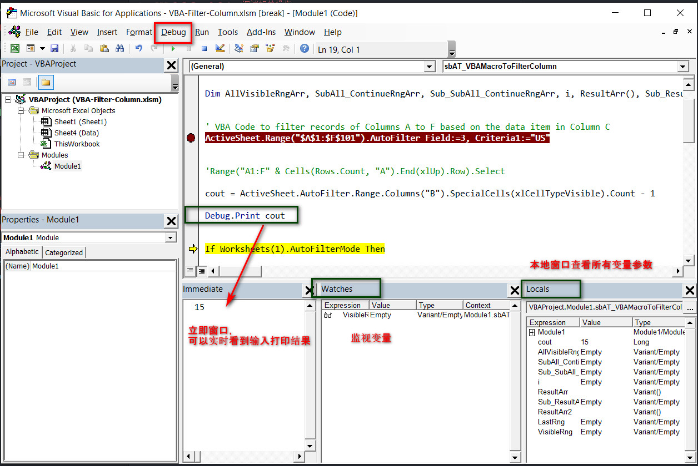

### 8.5 Excel-VBA Debug调试相关操作

在工作窗口，上方菜单栏中，有一个专门的额菜单：Debug 菜单，里面有debug相关操作。

除此之外你也需要一些辅助窗口来帮助你更好的进行调试，

**1. Immediate window（立即窗口）：**

类似其他IDE的console控制台。 
显示快捷键：`Ctrl + G`，也可以点击菜单栏 View -> <u>I</u>mmediate window 显示。 
当在调试debug的时候，可以使用`Debug.Print "xxxlog"`的时候可以在该窗口直接显示打印结果。

**2. Watches window（监视窗口）：**

右键点击所要监视的变量，点击 `Add Watch...` 点击OK 会出现监视窗口，方便我们监视变量值。

**3. Locals window（本地窗口）：**

点击菜单来View ↠　Locals Window，会显示本地窗口，显示所有参数变量。

view：
  
