# 简明Excel VBA
Last update date：08/31/2023 20:15

> `VBA` 缩写于 *Visual Basic for Applications*。

    无论是VBA还是Automation，亦或是RPA工具，如果你有录制一个脚本的想法，那么依然非常的初级。
    一定不要有录制的思想。
        --bluetata 09/08/2021 14:31

<!-- TOC -->

## 目录

- [x] [0x00 如何创建一个宏](#createAMacro) (English Version)
- [x] [0x01 语法说明](#explanation) (done)
    - [1.1 数据和数据类型](#1.1)
    - [1.2 常量和变量](#1.2)
    - [1.3 数组](#1.3)
        - [1.3.1 数组的基本定义](#1.3.1)
        - [1.3.2 二维数组](#1.3.2)
        - [1.3.3 数组维数的转换（Transpose）](#1.3.3)
        - [1.3.4 循环遍历数组的两种方式](#1.3.3)
        - [1.3.5 其他数组函数](#1.3.4)
    - [1.4 运算符](#1.4)
    - [1.5 语句结构](#1.5)
        - [1.5.1 选择语句](#1.5.1)
        - [1.5.2 循环语句](#1.5.2)
        - [1.5.3 GoTo 语句](#1.5.3)
        - [1.5.4 Exit 语句](#1.5.4)
    - [1.6 过程(Sub)和函数(Function)](#1.6)
      - [1.6.1 Sub 过程](#1.6.1)
      - [1.6.2 Function 函数](#1.6.2)
      - [1.6.3 VBA的参数传递](#1.6.3)
      - [1.6.4 ByRef vs ByVal](#1.6.4)
    - [1.7 正则表达式(Regular Expression)](#1.7)
    - [1.8 注释（Comments code）](#1.8)
    - [1.9 补充](#1.9)
    - [1.10 示例](#1.10)
    - [1.11 VBA中的转义](#1.11)
- [x] [0x02 VBA界面介绍](#layout) (done)
    - [2.x VBA开发工具的选择](#2.x)
    - [2.1 整体界面说明](#2.1)
    - [2.2 工程资源管理器（Project Explore）说明](#2.2)
    - [2.3 设置VBA Macro Project 密码保护](#2.3)
    - [2.4 常用快捷栏及窗口设置](#2.4)
- [x] [0x03 对象操作说明](#object-option) (done)
    - [3.1 对象简述](#3.1)
    - [3.2 Application对象](#3.2)
- [x] [0x04 字符串 String 相关常用操作](#string-option) (done)
    - [4.1 Trim](#4.1)
    - [4.2 Instr 和 InStrRev (类似indexOf函数)](#4.2)
    - [4.3 Mid (类似substring函数)](#4.3)
    - [4.4 Left 和 Right](#4.4)
    - [4.5 Replace](#4.5)
    - [4.6 StrReverse 倒转函数](#4.6)
    - [4.7 其他字符串函数](#4.7)
- [ ] [0x05 Excel 相关常用操作](#excel-option) (doing)
    - [5.1 Excel 基础操作](#5.1)
    - [5.2 打开Excel两种方式](#5.2)
    - [5.3 操作Excel工作表（Worksheet）](#5.3)
    - [5.4 Excel AutoFilter / Excel 自动筛选操作](#5.4)
    - [5.5 清理Excel数据相关操作](#5.5)
    - [5.6 循环遍历Excel中所有sheet](#5.6)
- [x] [0x06 文件 相关常用操作](#0x06) (done)
    - [6.0 获取文件路径相关方法](#6.0)
    - [6.1 判断文件，文件夹等是否存在](#6.1)
    - [6.2 文件相关操作](#6.2)
    - [6.3 文件夹相关操作](#6.3)
    - [6.4 其他操作（获取文件名等）](#6.4)
- [x] [0x07 日期和时间 相关函数](#0x07) (done)
    - [7.1 Date, Time, Now 函数](#7.1)
    - [7.2 日期函数：Year, Month, Day](#7.2)
    - [7.3 CDate 和 DateValue 函数](#7.3)
    - [7.4 IsDate 函数](#7.4)
    - [7.5 DateAdd 函数](#7.5)
    - [7.6 Sleep 函数](#7.6)
- [x] [0x08 消息框的函数 MsgBox](#0x08) (done)
- [x] [0x10 VBA 转换函数一览](#0x10) (done) (*English Version*)
    - [10.1 取整函数的使用](#10.1)
- [x] [0x90 VBA Best Practices（VB代码规范/开发规约）](#0x90) (English Version)
- [ ] [0x91 Trouble shooting](#0x91) (doing)
    - [91.01 消除Excel保存时警告（Privacy Warning:this document contains macros...）](#19.1)
    - [91.02 清除Excel数据透视表中过滤器缓存（旧项目）](#91.2)
    - [91.03 解决办法：The macros in this project are disabled. Please refer to ...](#91.3)
    - [91.04 解决办法：添加一个宏文件(第三方插件)到快速访问栏](troubleshootings/Macro2QuickToolBar.md)
    - [91.05 解决办法：如何修改编辑一个.xlam文件/解决保存修改后的.xlam文件再次内容消失问题](troubleshootings/EditXlamFile.md)
    - [91.06 解决办法：使用SaveAs方法保存.xlsx后，再次打开提示: 文件损坏,后缀名错误（格式错误）](troubleshootings/SaveAsIssue.md)
    - [91.07 解决办法：Excel每次保存时都弹出警告：“此文档中包含宏、Activex控件、XML扩展包信息”（office 2007/2010/365+）](#91.7)
    - [91.08 解决办法：使用.xlam宏文件执行VBA程序时，操作excel无任何反应](#91.8)
    - [91.09 解决办法：复位Excel到A1单元格，锁定缩放比例85%](#91.9)
    - [91.10 解决办法：编译错误 找不到工程或库](#91.10)
    - [91.11 解决办法：错误的参数号或无效的属性赋值](#91.11)
    - [91.12 解决办法：无法打开`xlsm`文件，一直加载`FUNCRES.XLAM`插件](#91.12)
    - [91.13 解决办法：公式不更新刷新，在excel中生成的worksheet，公式不自动计算更新](#91.13)
- [x] [0x92 VBA示例代码](#0x92) (done)
- [ ] [0x93 Excel-VBA 快捷键](#0x93) (doing)
- [x] [0x94 Excel-VBA Debug调试](#0x94) (done)
- [ ] [0x95 VBA封装共通函数](#0x95) (doing)
    - [95.01 VBA生成GUID/UUID](#95.01)
    - [95.02 VBA程序进度条(Process Bar)](#95.02)
- [x] [Excel VBA代码加密方案汇总（如何尽可能的保护VBA代码？）](#0x96) (done)
- [x] [0xFF 学习资源列表](#docslist) (done)

<!-- /TOC -->


<a name="createAMacro"></a>
## 0x00 如何创建一个宏
*Ref：* [如何创建一个宏](CreateAMacro.md) (English Version)


<a name="explanation"></a>
## 0x01 语法说明

都知道学会了英语语法，再加上大量的词汇基础，就算基本掌握了英语了。
类似的要使用vba，也要入乡随俗，了解他的构成，简单的说vba包含`数据类型`、
`变量`/`常量`、`对象`和常用的`语句结构`。

不过呢在量和复杂度上远低于英语，不用那么痛苦的记单词了，所以vba其实很简单的。
熟悉了规则之后剩下就是查官方函数啦，查Excel提供的可操作对象啦。

顺带一提的是，函数其实也很容易理解，方便使用。拿到一个函数，例如`Sum`，
只要知道它是求多个数的和就够了，剩下的就是用了。例如`Sum(1000,9)`结果就是`1009`了。
函数的一大好处就是隐藏具体实现细节，提供简洁的使用方法。


<a name="1.1"></a>
### 1.1 数据和数据类型

Excel里的每一个单元格都是一个`数据`，无论是数字、字母或标点都是数据。
对数据排排队，吃果果，对不同的数据扔到不同的篮子里归类，篮子就是`数据类型`了。

在Excel-vba中，`数据类型`只有`数值`、`文本`、`日期`、`逻辑`或`错误`五种类型。
前四种最为常用。具体描述参见下表：


| 类型 | 类型名称 | 范围 | 占用空间|声明符号 | 备注|
|--------|-------|-----|--------|-----|----|
| **逻辑型**|
| 布尔 | Boolean|逻辑值True或False|2|
|**数值型**|
|字节| Byte | 0~255的整数|1|
|整数| Integer| -32768~32767|2|%|
|长整数|Long|-2147483648~2147483647|4|&|
|单精度浮点|Single||4|!|
|双精度浮点|Double||4|#|
|货币|Currency||8|@|
|小数|Decimal||14|
|**日期型**|
|日期|Date|日期范围:100/1/1~9999/12/31|8|
|**文本型**|
|变长字符串|String|0~20亿||$|
|定长字符串|String|1~65400||
|**其他**|
|变体型|Variant(数值)|保存任意数值，也可以存储Error,Empty,Nothing,Null等特殊数值|
|对象|Object|引用对象|4|

表1.1 VBA数据类型

补充一点是，数组就像一筐水果，里面可以存不止一个数据。
但它不是一个具体的数据类型，叫数据结构更合适些。


<a name="1.2"></a>
### 1.2 常量和变量

定义后不能被改变的量，就是`常量`；相反的`变量`就能修改具体值。

在vba里，使用一个 变量/常量 要先声明。

`常量`声明方法如下：</br>
` Const 常量名称 As 数据类型 = 存储在常量中的数据`
例如：
```vba
Const PI As Single = 3.14 ' 定义一个浮点常量为PI，值为3.14
```

`变量`声明方法如下：</br>
```vba
Dim 变量名 As 数据类型
```
变量名，必须**字母**或**汉字**开头，**不能** 包含空格、句号、感叹号等。

数据类型，对应上面 ↑　表1.1里的那些

更多的声明方法，跟`Dim`声明的区别是作用范围不同：

```
Private v1 As Integer   ' v1为私有整形变量
Public v2 As String     ' v2为共有字符串变量
Static v3 As Integer    ' v3为静态变量，程序结束后值不变

' 变量声明之后，就可以赋值和使用了
v1 = 1009
v2 = "1009"
v3 = 1009

' 使用类型声明符，可以达到跟上面同样的效果
public v2$  ' 与 Public v2 As String 效果一样

' 声明变量时，不指定具体的类型就变成了Variant类型，根据需要转换数据类型
Dim v4
```

**注意：**   
这里提一下在VBA开发规范中有一条： **强制** 使用 `Option Explicit`。   
`Option Explicit` 语句自动提醒要求开发者正式地声明你的变量，这个语句必须放在每个模块的最上面。如果你试图运行一个含有未定义的变量的过程时，Option Explicit语句会让VBA产生一个错误信息。   

总结：Option Explicit   

`Option Explicit` 语句在模块级别中使用，强制显示声明模块中的所有变量。   
`Option Explicit` 语句必须写在模块的所有过程之前。   
如果模块中使用了 `Option Explicit`，则必须使用 Dim、Private、Public、ReDim 或 Static 语句来显式声明所有的变量。   

    ---------------------------------------------
    explicit 英 [ɪkˈsplɪsɪt]  美 [ɪkˈsplɪsɪt]
    adj. 明确的，清楚的; 直言的; 详述的; 不隐瞒的;  
    ---------------------------------------------

另外在 **工具** → **选项** 中勾选 "要求变量声明(*Require Variable Declaration*)"，那么新插入一个模块时，就会在第一行显示这句代码，强制要求程序中要声明变量（如下图）。

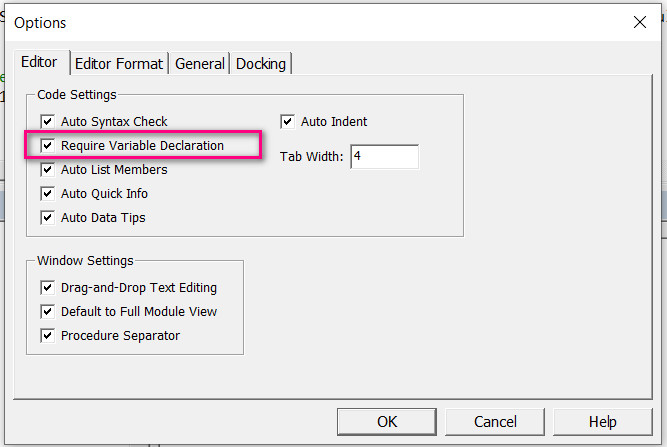


<a name="1.3"></a>
### 1.3 数组


<a name="1.3.1"></a>
#### 1.3.1 数组的基本定义
使用数组和对象时，也要声明，这里说下数组的声明：

```vba
    ' 确定范围的数组，可以存储b - a + 1个数，a、b为整数
    Dim 数组名称(a To b) As 数据类型

    Dim arr(1 TO 100) As Integer ' 表示arr可以存储100个整数
    arr(100) '表示arr中第100个数据

    ' 不指定a，直接声明时，默认a为0
    Dim arr2(100) As Integer ' 表示arr可以存储101个整数,从0数
    arr2(100) '表示arr2中第101个数据

    ' 多维数组
    Dim arr3(1 To 3, 1 To 3, 1 To 3) As Integer ' 定义了一个三维数组，可以存储3*3*3=27个整数

    ' 动态数组，不确定数组大小时使用
    Dim arr4() As Integer   ' 定义arr4为整形动态数组
    ReDim arr4(1 To v1)     ' 设定arr4的大小，不能重新设定arr4的类型

```

除了用`Dim`做常规的数组的声明，还有下面这些声明数组的方式:
```vba
    ' 使用`Array`函数将已知的数据常量放到数组里
    Dim arr As Variant        ' 定义arr为变体类型
    arr = Array(1, 1, 2, 3, 5, 8, 13, 21) ' 将整数存储到arr中,索引默认从0开始

    ' 使用Split函数分隔字符串创建数组
    Dim arr2 As Variant
    arr2 = Split("hello, world", ", ") ' 按,分隔字符串 hello,world 并赋值给arr2

    ' 使用Excel单元格区域创建数组
    ' 这种方式创建的数组，索引默认从1开始
    Dim arr3 As Variant
    arr3 = Range("A1:C3").Value   ' 将A1:C3中的数组存储到arr3中
    Range("A4:C6").Value= arr3    ' 将arr3中的数据写入到A4:C6中的区域
```


<a name="1.3.2"></a>
#### 1.3.2 二维数组

定义：

1. 使用 `Variant` 定义二维数组：</br>

```
Dim ArrTD(3, 3) As Variant    ' 定义一个 `4 x 4`的 4行4列的二维数组 等价于：ArrTD(0 To 3, 0 To 3)
Dim ArrTD(1 To 3, 1 To 4)     ' 创建一个可以容下3行4列的数组空间
```
2.  动态创建二维数组（参照如下动态传进方法）

    参照如下：

**静态和动态数组**

**静态数组** 是具有确定大小的数组。静态数组的大小是在数组的声明语句里确定的。</br>
**动态数组** 是大小可以改变的数组。如果数组的大小每次都由程序运行而决定的话，就使用动态数组。


```
'---------------------------------------------'
' 定义动态数组的步骤：
Dim arr()
Redim arr(1 to 3, 1 to 1)
Redim Preserve arr(1 to 3, 1 to 5)
'---------------------------------------------'

' 举例：
Sub Resize2D()

    Dim varArray() as Variant       ' 初始化数组

    ReDim varArray(1, 2)            ' 定义一个两行三列的二维数组
    varArray(0, 0) = "Mel Smith"
    varArray(0, 1) = "Fred Buckle"
    varArray(0, 2) = "Jane Eyre"
    varArray(1, 0) = "Accountant"
    varArray(1, 1) = "Secretary"
    varArray(1, 2) = "Doctor"

    ReDim Preverve varArray(1, 3)    ' 重新定义二维数组，变成两行四列
    'populate the array with additional values
    varArray(0, 3) = "Rob Barnes"
    varArray(1, 3) = "Plumber"
End Sub
```

**注意：** 在动态二维数组中，第一维在第一次扩容的时候就定死了，以后只能修改第二维。
再次扩容第二维的时候，记得加 `Preserve` 关键字，否则数组中的原有数据就会丢失。


<a name="1.3.3"></a>
#### 1.3.3 数组维数的转换（Transpose）

1. 一维转二维
```
Sub arr_tranpose1()
    arr = Array(10, "bluetata", 2, "blue", 3)
    arr1 = Application.Transpose(arr)
    MsgBox arr1(2, 1) '转换后的数组是1列多行的二维数组
End Sub
```

2. 二维数组转一维 '注意:在转置时只有1列N行的数组才能直接转置成一维数组
```
Sub arr_tranpose2()
    arr2 = Range("A1:B5")
    arr3 = Application.Transpose(Application.Index(arr2, , 2)) '取得arr2第2列数据并转置成1维数组
    MsgBox arr3(4)
End Sub
```


<a name="1.3.4"></a>
#### 1.3.4 循环遍历数组的两种方式

```
' 循环遍历Variant数组方法1：
Dim Arr As Variant
Dim i As Integer

Arr = Array(1, 2, 3, 4, 5)
For i = 0 To UBound(Arr)
    Debug.Print Arr(i)
Next i
```

```
' 循环遍历Variant数组方法2：
Dim Arr As Variant
Dim i As Variant

Arr = Array(1, 2, 3, 4, 5)

For Each i In Arr
    Debug.Print i
Next i
```

动态数组的循环：
```
Function FnTwoDimentionDynamic()

    Dim arrTwoD()    
    Dim intRows
    Dim intCols

    intRows = Sheet9.UsedRange.Rows.Count
    intCols = Sheet9.UsedRange.Columns.Count

    ReDim Preserve arrTwoD(1 To intRows, 1 To intCols)

    For i = 1 To UBound(arrTwoD, 1)
        For j = 1 To UBound(arrTwoD, 2)
            arrTwoD(i, j) = Sheet9.Cells(i, j)            
        Next
    Next

   MsgBox "The value is B5 is " & arrTwoD(5, 2)

End Function
```


**注意：**   
###### 1. 使用 `Dim` 声明动态数组时，不能直接在数组中使用变量   
即 `Dim arr(1 to 变量)` 是错误的。   
而应该是：

  1、先用Dim声明，Dim arr()或arr。   
  2、然后Redim arr(1 to 变量)  即: Redim(重新声明) 动态数组时可以使用变量

```
Dim tempArray() As Integer
ReDim tempArray(1 To v1)
```
动态数组赋值：</br>

```
    Dim intDynamicArray()

    For i = 0 To 10
        ReDim intDynamicArray(i)    '多次redim,适合不知道数组大小时
        intDynamicArray(i) = i * i
        Debug.Print intDynamicArray(i)
    Next
```


###### 2. 使用 `ReDim Preserve` 声明动态数组时，只能改变最末维的大小。
即 `Redim Preserve arr(1 to k1, 1 to 2)` 是错误的。   
而应该是：

```
Redim Preserve arr(1 to 2, 1 to k1) ' 重新定义数组的大小，又可以保留数组内现有的值
```
动态数组中用Redim改变数组最后一维的大小，但是如果数组中已经有了数据，如果只用Redim的形式的话，数组中原有的数组就会丢失，为了保留数据，就需要加 `Preserve` 关键字。


<a name="1.3.5"></a>
#### 1.3.5 其他数组函数

| 函数 | 函数说明 | 参数说明 |
|----|----|----|
|`UBound(Array arr, [Integer i])`|数组最大的索引值|`arr`：数组；`i`：整形，数组维数|
|`LBound(Array arr, [Integer i])`|数组最小的索引值|同上|
|`Join(Array arr, [String s])`|合并字符串|`arr`：数组；`s`：合并的分隔符|
|`Split(String str, [String s])`|分割字符串|`str`：待分割的字符串；`s`：分割字符串的分隔符|
|`Erase ArrayName`|擦拭清空数组|`ArrayName`：需要被清空的数组名|


函数说明

UBound(Array arr,[Integer i]);</br>
UBound为函数名</br>
arr和i 为UBound的的参数，用中括号括起来的表示i为非必填参数</br>
arr和i 之前的Array，Integer表示对应参数的数据类型</br>

示例：
```
Dim lngUpperNum As Long
Dim MyArray(1 To 10, 5 To 15, 10 To 20)    ' 定义数组变量.
Dim AnyArray(10)
lngUpperNum = UBound(MyArray, 1)    ' 返回 10.
lngUpperNum = UBound(MyArray, 3)    ' 返回 20.
lngUpperNum = UBound(AnyArray)      ' 返回 10.
lngUpperNum = LBound(AnyArray, 2)   ' 返回 5.
```

**Erase** 清空数组函数

语法：Erase ArrayName

Erase 释放动态数组所使用的内存，下次引用该动态数组之前，必须使用 `ReDim` 重新声明数组变量和维数。

* 固定数值数组，数组中的每个元素重置为零
* 固定字符串数组，数组中的每个元素被重置为零长度 ""
* 固定 Variant 数组，数组中的每个元素将被设置为 Empty。
* 对象数组，数组中的每个元素被重置为特殊值 Nothing

```
' Declare array variables.
Dim NumArray(10) As Integer         ' Integer array.
Dim StrVarArray(10) As String       ' Variable-string array.
Dim StrFixArray(10) As String * 10  ' Fixed-string array.
Dim VarArray(10) As Variant         ' Variant array.
Dim DynamicArray() As Integer       ' Dynamic array.
ReDim DynamicArray(10)              ' Allocate storage space.
Erase NumArray                      ' Each element set to 0.
Erase StrVarArray                   ' Each element set to zero-length string ("").
Erase StrFixArray                   ' Each element set to 0.
Erase VarArray                      ' Each element set to Empty.
Erase DynamicArray                  ' Free memory used by array.
```


> 补充
> [VBA 内置函数列表](https://msdn.microsoft.com/zh-cn/library/office/jj692811.aspx)


<a name="1.4"></a>
### 1.4 运算符

运算符的作用是对数据进行操作，像加减乘除等。这块不再具体说明，列一下vba中常用的运算符。

|运算符|作用|示例|
|----|----|----|
|**算术运算符**|
|+|求两个数的和|
|-|求两个数的差|
|*|求两个数的乘积|
|/|求两个数的商|
|`\`|求两个数相除后所得商的整数|
|^|求一个数的某次方|
|Mod|求两个数相除后所得的余数| 10 Mod 9=1|
|**比较运算符**|
|=|比较两个数据是否相等|相等返回 True;否则返回False|
|<>|不相等|
|<|小于|
|>|大于|
|<=|不大于|
|>=|不小于|
|Is|比较连个对象的引用关系|
|Like|比较两个字符串是否匹配| String1 Like String2|
|**文本运算符**|
|+|连接两个字符串|
|&|连接两个字符串|
|**逻辑运算符**|
|And|逻辑与|
|Or|逻辑或|
|Not|逻辑非|
|Xor|逻辑抑或|`表达式1 Xor 表达式2`两个表达式返回的值不相等时为True|
|Eqv|逻辑等价|`表达式1 Eqv 表达式2`两个表达式返回的值相等时为True|
|Imp|逻辑蕴含|

```vba
' Like是个比较有用的运算符，常用来做匹配或模糊匹配。
' 在模糊匹配的时候，有一些通配符能方便模糊匹配规则的书写
"这是一个demo1" Like "*demo1" = True    ' * 号表示匹配任意多个字符
"这是一个demo2" Like "????demo2" = True ' ? 号表示匹配任意单个字符
"这是一个demo3" Like "*demo#" = True    ' # 号表示匹配任意数字
```


#### 三目运算符

正常在VBA中没有类似java的 `expression ? true : false` 写法，但是可以使用 `IFF` 来代替：
```vba
x = IIF(expression, A, B）
x = IIF(条件, 如果成立A赋值给X, 如果不成立B赋值给X）
```

作用也等同于如下：
```
If ... Then
Else
End If
```


<a name="1.5"></a>
### 1.5 语句结构

程序通常都是顺序依次执行的。语句结构用来控制程序执行的步骤，
一般有**选择**语句、**循环** 语句。


<a name="1.5.1"></a>
#### 1.5.1 选择语句

选择语句用来判断程序执行那一部分代码

语法：If ... Then ... End If</br>
If选择可以嵌套使用</br>

常用的三种形式：

1. 普通模式
```vba
If 10 > 3 Then
    操作1  ' 执行这一步
End If

' 增加Else和Else If逻辑
If 1 > 2 Then
    操作1
ElseIf 1 = 2 Then
    操作2
Else
    操作3  ' 执行这一步
End If
```

2. 嵌套If语句
```vba
If 10 > 3 Then
    If 1 > 2 Then
        操作1
    Else
        操作2  ' 执行这一步
    End If
Else
    操作3
End If
```

3. Select ... Case ... 多选一，类似于java中的 Switch ... Case ... 语句
```vba
Dim Length As Integer
Length = 10
Select Length
    Case Is >= 8
        操作1  ' 执行这一步
    Case Is > 20
        操作2
    Case Else
        操作3
End Select
```
sample code:

```vba
Private Sub switch_demo_Click()
    Dim MyVar As Integer
    MyVar = 1

    Select Case MyVar
        Case 1
            Debug.Print "The Number is the Least Composite Number"
        Case 2
            Debug.Print "The Number is the only Even Prime Number"
        Case 3
            Debug.Print "The Number is the Least Odd Prime Number"
        Case Else
            Debug.Print "Unknown Number"
    End Select
End Sub
```


<a name="1.5.2"></a>
#### 1.5.2 循环语句

循环语句用来让程序重复执行某段代码

1. 普通For ... Next循环</br>
语法：For 循环变量 = 初始值 To 终值 Step 步长</br>
注：在VBA循环中可以使用`Exit`关键字来跳出循环，类似于Java中的break，</br>
在for循环中语法为：`Exit For`，在do while循环中为：`Exit Do`，也可以利用`GoTo`语句
跳出本次循环，详见：[1.5.3 GoTo语句](#1.5.3)</br>
```vba
Dim i As Integer
For i = 1 To 10 Step 2 ' 设定i从1到10，每次增加2，总共执行5次
    操作1   ' 可以通过设定 Exit For 退出循环
Next i
```

2. For Each ... 循环</br>
语法：For Each 变量 In 集合或数组
```vba
Dim arr
Dim i As Integer
arr = Array(1, 2, 3, 4, 5)
For Each i In arr ' 定义变量i，遍历arr数组
    操作1
Next i
```

3. Do ... While循环</br>
语法：</br>
- 前置循环条件：</br>
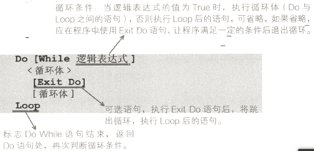

- 后置循环条件：</br>
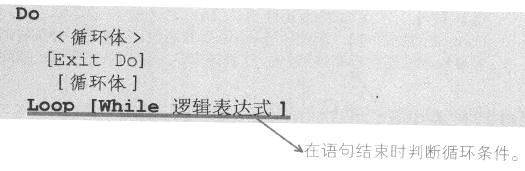

Sample code:
```vba
Dim i As Integer
i = 1
Do While i < 5  ' 循环4次  # 感谢`WANG Cheng`的指正 2020年7月16日 下午4:57
    i = i + 1
Loop

' ===============================================
' 将判断条件后置的Do...While
Dim i As Integer
i = 1
Do
    i = i + 1
Loop While i < 5 ' 循环4次  # 感谢`WANG Cheng`的指正 2020年7月16日 下午4:57
```

4. Do Until 直到...循环</br>
语法：</br>
Do Until 表达式    表达式为真时跳出循环
```vba
Dim i As Integer
i = 5
Do Until i < 1  
    i = i - 1
Loop

' ===============================================
' 后置的Do Until
Dim i As Integer
i = 5
Do
    i = i - 1
Loop Until i < 1  
```


<a name="1.5.3"></a>
#### 1.5.3 GoTo语句

**GoTo**
无条件地分支直接跳转到过程中指定的行。

**注：** GoTo语句大多用于错误处理时，但会影响程序结构，增加阅读和代码调试难度，
除非必要时，应尽量避免使用GoTo语句。

```vba
Sub TestGoTo

    Dim lngSum As Long, i As Integer
    i = 1

JUMPX:
    i = i + 1
    If i <= 100 Then GoTo JUMPX
    Debug.Print "1到100的自然数之和是：" & lngSum

End Sub
```

**CONTINUE**

循环中实现continue操作，类似java语言的continue直接跳出本次循环
```vba
Sub continueTest()
    Dim i

    For i = 0 To 5
        If i = 1 Then
            '// 跳转到CONTINUE部分
            GoTo CONTINUE
        ElseIf i = 3 Then
            '// 跳转到CONTINUE部分
            GoTo CONTINUE
        End If

        '//没有GoTo语句的时候打印counter: i
        Debug.Print i

CONTINUE:   '// countinue跳转块，可以写逻辑，如果没有逻辑就直接进行下次循环
    Next

End Sub
```

`选择`和`循环`提供了多种实现同一目的的语句结构，他们都能实现同样的作用，
差别一般是初始条件。还有书写的复杂度。正确的选择要使用的语句结构，
代码逻辑上会更清楚，方便人的阅读。

**简写**

在操作对象的属性时常常要先把对象调用路径都写出来，用`with`可以简化这一操作
```vba
' 简化前
WorkSheets("表1").Range("A1").Font.Name="仿宋"
WorkSheets("表1").Range("A1").Font.Size=12
WorkSheets("表1").Range("A1").Font.ColorIndex=3

' 使用`With`
With WorkSheets("表1").Range("A1").Font
    .Name = "仿宋"
    .Size = 12
    .ColorIndex =3
End With
```


<a name="1.5.4"></a>
#### 1.5.4 Exit 语句

Exit 可以退出过程或块并立即将控制转移到过程调用或块定义之后的语句。   

语法：   

```
Exit { Do | For | Function | Property | Select | Sub | Try | While }
```

举例：   


```
Dim index As Integer = 0
Do While index <= 100
    If index > 10 Then
        Exit Do
    End If

    Debug.Write(index.ToString & " ")
    index += 1
Loop

Debug.WriteLine("")
' Output: 0 1 2 3 4 5 6 7 8 9 10


Function MyFunction(ByVal j As Integer) As Double
    MyFunction = 3.87 * j
    Exit Function
End Function


```


<a name="1.6"></a>
### 1.6 过程(Sub)和函数(Function)

概述Sub和Function的区别：   

**Sub** 和 **Function** 是VBA提供的两种封装体。
* 利用宏录制得到的就是`Sub`。
* `Sub` 定义时无需定义返回值类型，而 `Function` 一般需要用 “As 数据类型” 定义函数返回值类型。
* `Sub` 中没有对过程名赋值的语句，而 `Function` 中有对函数名赋值的语句，一般在函数最后返回值，格式如下：
```vba
Set functionName = xxxxxx
```
* 调用过程：调用 Sub 过程与 Function 过程不同。调用 Sub 过程的是一个独立的语句，而调用函数过程只是表达式的一部分。另外，自定义函数并不允许修改工作表和单元格格式 (A UDF will only return a value it won't allow you to change the properties of a cell/sheet/workbook. )。但是，与 Function 一样，Sub 也可以修改传递给它们的任何变量的值。
* 调用 Sub 过程有三种方法：   [参见1.6.1](#1.6.1)   

~~以下语句都调用了名为 ProcExcel 的 Sub 过程。~~

  ~~Call  ProcExcel (FirstArgument, SecondArgument) '使用Call关键字调用~~   
  ~~ProcExcel  FirstArgument, SecondArgument        '直接调用~~   
  ~~Application.Run "ProcExcel" FirstArgument, SecondArgument~~   


~~**注意** ：当使用 Call 语法时，**参数必须在括号内**。若省略 Call 关键字，则也必须省略参数两边的括号。~~


<a name="1.6.1"></a>
#### 1.6.1 Sub 过程
```vba
[Private|Public] [Static] Sub 过程名([参数列表 [As 数据类型]])
    [语句块]
End Sub
' [Private|Public]定义过程的作用范围
' [Static]定义过程是否为静态
' [参数列表]定义需要传入的参数
```

调用`Sub`的方法有三种，使用 `Call`、<u>直接调用</u>和使用 `Application.Run`:

举个例子：


**注意** ：当使用 Call 语法时，**参数必须在括号内**。若省略 Call 关键字，则也必须省略参数两边的括号。

<a name="1.6.2"></a>
#### 1.6.2 Function 函数

vba内部提供了大量的函数，也可以通过`Function`来定义函数，实现个性化的需求。

VBA 函数`Function`的基本语法如下：
```vba
[Public|private] [Static] Function 函数名([参数列表 [As 数据类型]]) [As 返回值数据类型]
    [语句块]
    [函数名=返回值]
End Function
```
使用函数完成上面的例子：


<a name="1.6.3"></a>
#### 1.6.3 VBA的参数传递

参数传递的方式有两种，引用和传值。
传值，只是将数据的内容给到函数，不会对数据本身进行修改。
引用，将数据本身传给函数，在函数内部对数据的修改将同样的影响到数据本身的内容。

参数定义时，使用`ByVal`关键字定义传值，子过程中对参数的修改不会影响到原有变量的内容。
默认情况下，过程是按引用方式传递参数的。在这个过程中对参数的修改会影响到原有的变量。
也可以使用`ByRef`关键字显示的声明按引用传参。
```vba
Sub St1(ByVal n As Integer, ByRef range)
    ...Other code
End SUb
```

<a name="1.6.4"></a>
#### 1.6.4 ByRef vs ByVal

举个简单栗子来解释值传和引用传递的区别：   
可以参照[Create A Macro](CreateAMacro.md) 在工作表上放置一个command button，并添加以下代码：

```
Dim x As Integer
x = 10

MsgBox Triple(x)
MsgBox x
```

在上述代码中调用了`Triple`函数，按照如下步骤添加一个`Triple`函数模块：

1. 打开 [Visual Basic Editor](CreateAMacro.md#visual-basic-editor)，点击菜单栏中的 <U>I</U>nsert ，选择插入一个 <U>M</U>odule.

2. 添加如下代码：

```
Function Triple(ByRef x As Integer) As Integer

x = x * 3
Triple = x

End Function
```

当点击 command button 的时候显示如下结果：


3. 使用 `ByVal`替换`ByRef`:

```
Function Triple(ByVal x As Integer) As Integer

x = x * 3
Triple = x

End Function
```
当点击 command button 的时候显示如下结果为：


**说明：** 当通过引用(ByRef)传递参数时，我们引用的是原始值。函数中`x`的值(原始值)发生了变化。因此，第二个MsgBox显示的值为30。当通过值传递(ByVal)参数时，我们是在向函数传递一个副本。原始值没有改变。因此，第二个MsgBox显示的值为10(原始值)。

**总结：**
**ByRef** 传递一个指向变量的指针，因此任何更改都会在使用该变量的任何地方反映出来（改变一处，其他所有使用该变量的地方均会改变）。   
**ByVal** 将变量的副本传递给函数，因此对该变量的任何更改都不会影响其原始值。当使用ByVal传递一个对象，你传递的是一个指针的拷贝而不是原始的指针(**注意:** 不是对象的拷贝)


**注意：**

1. 数组变量（Array）总是通过ByRef传递（只适用于实际声明为 *Array* 的变量，不适用于`Variants`声明的数组变量）。
2. VBA在不具体指定传值方式的时候，默认为`ByRef`方式传值。

```
Function Triple(x As Integer) As Integer '当不声明指定具体值传递还是引用传递的时候，VBA默认为 ByRef 方式传值

'Or

Function Triple(ByRef x As Integer) As Integer

```

<a name="1.7"></a>
### 1.7 正则表达式(Regular Expression)
在VBA中使用正则表达式，因为正则表达式不是vba自有的对象，
故此要用它就必须采用两种方式引用它：一种是前期绑定，另外一种是后期绑定。

前期绑定：就是手工勾选工具/引用中的Microsoft VBScript Regular Expressions 5.5；
然后在代码中定义对象：`Dim regExp As New RegExp`；</br>
后期绑定：使用CreateObject方法定义对象：`CreateObject("vbscript.regexp")`

RegExp对象的属性：
   - Global – 设置或返回一个Boolean值，该值指明在整个搜索字符串时模式是全部匹配还是只匹配第一个。如果搜索应用于整个字符串，Global 属性的值应该为 True，否则其值为 False。默认的设置为True。
   - Multiline – 返回正则表达式是否具有标志, 缺省值为False。如果指定的搜索字符串分布在多行，这个属性是要设置为True的。
   - IgnoreCase – 设置或返回一个Boolean值，指明模式搜索是否区分大小写。如果搜索是区分大小写的，则IgnoreCase 属性应该为False；否则应该设为True。缺省值为True。
   - Pattern – 设置或返回被搜索的正则表达式模式。被搜索的正则字符串表达式。它包含各种正则表达式字符。

RegExp对象的方法：
- Execute – 对指定的字符串执行正则表达式搜索。需要传入要在其上执行正则表达式的文本字符串。正则表达式搜索的设计模式是通过RegExp对象的Pattern来设置的。Execute方法返回一个Matches集合，其中包含了在string中找到的每一个匹配的Match对象。如果未找到匹配，Execute将返回空的Matches集合。
- Replace – 替换在正则表达式查找中找到的文本。
- Test – 对指定的字符串执行一个正则表达式搜索，并返回一个Boolean值指示是否找到匹配的模式。Global属性对Test方法没有影响。如果找到了匹配的模式，Test方法返回True；否则返回False。
- MatchCollection对象与Match对象
匹配到的所有对象放在MatchCollection集合中，这个集合对象只有两个只读属性：
- Count：匹配到的对象的数目
- Item：集合的又一通用方法，需要传入Index值获取指定的元素。
一般，可以使用ForEach语句枚举集合中的对象。集合中对象的类型是Match。
- Match对象有以下几个只读的属性：
    - FirstIndex – 匹配字符串在整个字符串中的位置，值从0开始。
    - Length – 匹配字符串的长度。
    - Value – 匹配的字符串。
    - SubMatches – 集合，匹配字符串中每个分组的值。作为集合类型，有Count和Item两个属性。

Sample Code（前期绑定）：
```vba
Private Function IsStringDate(ByVal strDate As String)
    Dim strDatePattern
    ' 前期绑定
    Dim regEx As New RegExp, matches

    Dim str MatchContent As String

    strDatePattern = "^(([0-9])|([0-2][0-9])|([3][0-1]))\-(Jan|Feb|Mar|Apr|May|Jun|Jul|Aug|Sep|Oct|Nov|Dec)\-\d{4}$"

    With regEx
        .Global = True      ' 搜索字符串中的全部字符，如果为假，则找到匹配的字符就停止搜索！
        .MultiLine = False  ' 是否指定多行搜索
        .IgnoreCase = True  ' 指定大小写敏感（True）
        .Pattern = strDatePattern   ' 所匹配的正则
    End With

    If regEx.Test(strDate) Then     ' 如果与正则相匹配
        Set matches = regEx.Execute(strDate)
        MatchContent = matches(0).Value
    Else
        MatchContent = "Not Matched"
    End If

    IsStringDate = regEx.Test(strDate)

End Function
```

Sample Code（后期绑定）：
```vba
Function ExtractNumber(str As String) As String
    Dim regEx As Object
    Set regEx = CreateObject("vbscript.regexp")  ' 后期绑定
    With regEx
        .Global = True       ' 搜索字符串中的全部字符，如果为假，则找到匹配的字符就停止搜索！
        .Pattern = "\D"      ' 非数字字符的正则表达式
        ExtractNumber = .Replace(str, "")        ' 把非数字字符替换成空字符串
    End With
    Set regEx = Nothing      ' 清除内存中的对象变量的地址，即释放内存。
End Function
```


```
' 从一个字符串中提取年份
Public Function GetFescalYearByRegExp(ByVal strCheckedString As String) As String

    Dim regEx, matches As Object
    Set regEx = CreateObject("vbscript.regexp")  ' Create RegExp object by Late binding
    With regEx
        .Global = True
        .MultiLine = False
        .IgnoreCase = True
        .Pattern = STR_PATTERN_FESCAL_YEAR
    End With


    If regEx.Test(strCheckedString) Then
        Set matches = regEx.Execute(strCheckedString)
        GetFescalYearByRegExp = matches(0).Value    ' Return value.
    Else
        MsgBox ("Could NOT Find Any Fescal Year Flag")
        End
    End If

    Set regEx = Nothing

End Function
```


<a name="1.8"></a>
### 1.8 注释（Comments code）
> 个人觉得代码注释起着非常重要的作用。 --  *bluetata* 11/28/2018 18:40

注释语句是用来说明程序中某些语句的功能和作用；VBA 中有两种方法标识为注释语句。</br>
单引号 `'` 举例：`' 定义全局变量`；可以位于别的语句之尾，也可单独一行。</br>
`Rem` 举例：`Rem 定义全局变量`；只能单独一行

以下列举出了不同级别的注释代码，也可以[点击这里](SampleCode.bas)查看 VBA Sample Code。

#### 1. 源码概要注释/Source version Comments Code</br>
在每个source文件的最开头
```vba
'--------------------------------------
' Creation date : 03/05/2017  (cn)
' Last update   : 11/28/2018  (cn)
' Author(s)     : Sekito.Lv
' Contributor(s):
' Tested on Excel 2016
'--------------------------------------
```

#### 2. 区块注释/Use Title Blocks Comments code for Each Macro</br>
在每个Function或者Sub上下，根据个人风格，可以在紧贴在函数上面一行处，
也可以在函数名的下面一行处。
```vba
'=======================================================
' Program:   DoMemoData
' Desc:      Writes memo data to the memo sheet
' Called by: PrintControl
' Call:      DoMemoData wbkReport, oStopRow
' Arguments: wbkReport--Name of the report workbook
'            oStopRow--Number of the last row to process
' Comments: (1) RunReport initializes the m_oMemoRowNum
'               variable
'           (2) wksMemo doesn't need to be static. And
'               it's over-defined. Fix this at some
'               point.
' Changes----------------------------------------------
' Date        Programmer    Change
' 11/26/2018  Sekito.Lv     Written
' 11/28/2018  Sekito.Lv     Re-set memo object. This is
'                           needed at times in Excel 8
'                           when the report workbook must
'                           close then re-open.
'=======================================================
Sub DoMemoData(wbkReport As Workbook, oStopRow As Long)
```

#### 3. 行内注释/Use In-Line Comments
```vba
' If this routine was called by the batch routine...
If g_bCalledByBatch Then

    'Get the reference of the changing date cell
    sDateRef = GetNameVal("ChgDateCell", 0, g_nReference)

    ' If the date name is empty, return null sDateFormula
    If sDateRef = g_sNull Then
        sDateFormula = g_sNull

    ' Else, get the beginning formula in the date cell
    Else
        sDateFormula = m_wbkReport.Worksheets(1). _
        Evaluate(sDateRef).Formula
    End If
Else
```

#### 4. 函数列表注释/List of Function Comments</br>
一般紧挨着源码概要注释下面，与其空一行到两行
```vba
'-------------------------------------
' List of functions :
' - 1  - PublicHolidayFr
' - 2  - WorkingDay
' - 3  - WorkableDay
' - 4  - NextWorkingDay
' - 5  - NextWorkableDay
' - 6  - PrevWorkingDay
'-------------------------------------
```

<a name="1.9"></a>
### 1.9 补充

- 在vba中使用 `'`进行代码注释
- 在很长的语句中使用`_`来分割成多行
- 在有很多嵌套判断中，代码的可读性会变得很差，一般讲需要返回的内容及时返回，减少嵌套
- `Sub`中默认按引用传递参数，所以注意使用，一般不要对外面的变量进行修改，将封装保留在内部


- `Dim`和`Set`的关系及区分

很明显的是 vba中使用Dim设定变量类型，Set将对象引用赋值给变量

```vba
' 将Range对象赋值给变量rg
Dim rg As Range         ' 声明rg为Range对象
Set rg = Range("A1")    ' 设定rg为Range("A1")的引用，之后操作rg和操作Range("A1")一样了

' 如果不使用Set，下面的代码将报错
Dim rg As Range
rg = Range("A1")   ' 这段代码将报错

' 在非显示声明rg的前提下，下面的代码将会得到不一样的结果
rg = Range("A1")       ' rg将会是Range("A1")的内容，rg的类型将会是一种基本类型，Integer/String等
Set rg = Range("A1")   ' 这种情况下，rg将会是Range对象
```

- VBA中变量用Dim定义和不用Dim定义而直接使用有何区别？

用Dim语句声明变量就是定义该变量应存储的数据类型；
如果不指定数据类型或对象类型，也就是不用Dim定义，且在模块中没有 `Deftype` 语句，
则该变量按缺省设置是 `Variant` 类型。

- VBA中用Set赋值和不用Set赋值有什么区别？

给普通变量赋值使用`Let`，Let 可以**省略**。</br>
给对象变量赋值使用`Set`，Set **不能** 省略。

```vba
Sub AssignString()
    Dim strA As String
    Dim strB As String

    strA = "hello"      ' 本句也可写成 LET strA = "hello"
    Set strB = "hello"  ' 错误写法/Compile error
EndSub
```


#### 1.9.2 


<a name="1.10"></a>
### 1.10 示例

举个排序的例子，要对`A1:A20`的单元格区域进行排序，区域内的内容为1-100的随机整数，
规则是大于50的倒序排列，小于50的正序排列。将结果显示在`B1:B20`的区域里。

在这个例子中，首先定义一个`Sub`过程来随机生成`A1:A20`区域的内容。
代码如下:


```vba
' 创建随机整数，并赋值
Sub createRandom(times As Integer)
    Dim num As Integer
    Dim arr() As Integer
    ReDim arr(times)

    For num = 1 To times
        Randomize (1) ' 初始化随机数
        arr(num) = Rnd(1) * 10000 \ 100 ' Rnd随机数函数生成0~1的浮点数
        ' 上面使用了运算符进行取整，也可以根据需求使用vba内部的取整函数达到同样的效果
        ' arr(num) = Int(Rnd(1) * 100)
        ' arr(num) = Round(Rnd(1) * 100)
        Range("A" & num) = arr(num)
    Next num
End Sub

' 自定义排序
Function defSort(rgs) As Variant
    Dim arr() As Integer
    Dim total As Integer
    Dim rg
    Dim st As Integer  ' 数组开始标记
    Dim ed As Integer  ' 数组结束标记

    Debug.Print "rgs类型:"; TypeName(rgs)
    total = UBound(rgs)
    ReDim arr(total)
    st = 1
    ed = total

    ' 对数组分区
    For Each rg In rgs
        If rg > 50 Then
            arr(ed) = rg
            ed = ed - 1
        Else
            arr(st) = rg
            st = st + 1
        End If
    Next rg

    Dim i As Integer
    Dim j As Integer
    Dim tmp As Integer

    ' 冒泡排序
    For i = 1 To total
        For j = i To total
            If arr(i) > 50 And arr(j) > 50 Then '大于50的倒序排列
                If arr(i) < arr(j) Then
                    tmp = arr(i)
                    arr(i) = arr(j)
                    arr(j) = tmp

                    Debug.Print "大于50的"; i; j; tmp ' 程序运行过程中在立即窗口显示执行内容，用于调试程序
                End If
            ElseIf arr(i) <= 50 And arr(j) <= 50 Then ' 小于50的正序排列
                If arr(i) > arr(j) Then
                    tmp = arr(i)
                    arr(i) = arr(j)
                    arr(j) = tmp

                    Debug.Print "不大于50的"; i; j; tmp
                End If
            Else
                Exit For
            End If
        Next j
    Next i
    defSort = arr
End Function


' 程序入口
Sub main()
    Const SORT_NUM = 20
    Dim rgs
    Dim arr

    createRandom SORT_NUM ' 初始化待排序区域

    rgs = range("A1:A" & SORT_NUM)
    arr = defSort(rgs)

    ' 循环赋值
    For i = 1 To SORT_NUM
        range("B" & i) = arr(i)
    Next i
End Sub
```


<a name="1.11"></a>
### 1.11 VBA中的转义

1. "" 有转义规则

`"""` 相当于 `"`
`""""` 相当于 `"`
`"内部的"" 内部其他"`   显示结果为  `内部的"内部其他`


2. 符号常数生效

`chr(32)`   "空格
`chr(34)`   "双引号
`chr(39)`   "单引号
`chr(10)`   "换行  等同 vblf


<a name="layout"></a>
## 0x02 VBA界面介绍


<a name="2.x"></a>
### 2.x VBA开发工具的选择

有同学会问，进行VBA开发使用什么IDE，现在为止，VBA进行调试开发只能在微软Excel自带的开发窗口进行开发，既按`Alt+F11`操作界面，具体可以参照 [2.1 整体界面说明](#2.1)</br>
如果是单纯的进行开发，不做调试，可以使用VS Code，需要安装`VSCode VBA`插件。</br>


安装完后的操作界面如下图：
因为在VSCode中安装完插件后，有代码高亮和相关提示，进行单文件coding的时候会舒服很多</br>


<a name="2.1"></a>
### 2.1 整体界面说明

（点击图片查看大图）   
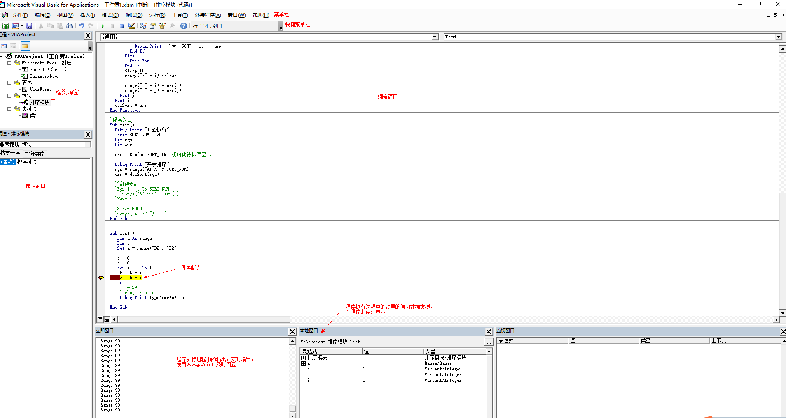


<a name="2.2"></a>
### 2.2 工程资源管理器（Project Explore）说明

显示快捷键：`Ctrl + R`，也可以点击菜单栏 View -> <u>P</u>roject Explore 显示。
在一个VBA项目中，实际可以在5个代码模块中书写VBA代码，如下图所示：

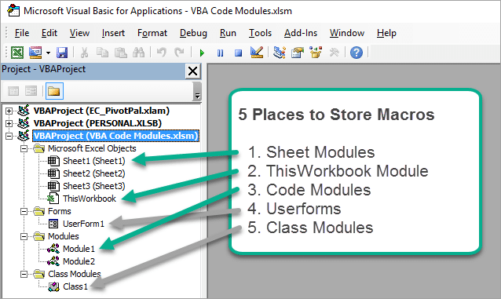

1. Code Modules – Code Modules是我们存储宏的最常见的地方。
模块位于工作簿中的 `Modules` 文件夹中。

2. Sheet Modules – 工作簿中的每个工作表在Microsoft Excel Objects文件夹中
都有一个工作表对象。双击sheet对象就会打开它的代码模块，我们可以在其中添加事件过程(宏)。
这些宏在用户执行表单中的特定操作时运行。比如如下code：
如果在该sheet中的选择位置发生改变，就会*自动执行* `Worksheet_SelectionChange` 方法，
选择所选单元格的整个行和列。

```VBA
Private Sub Worksheet_SelectionChange(ByVal Target As Range) ' Worksheet_SelectionChange
    Application.EnableEvents = False

    With Target
        Union(.EntireRow, .EntireColumn).Select
        .Activate
    End With

    Application.EnableEvents = True
End Sub
```

3. ThisWorkbook Module – 每个工作簿都包含一个 `ThisWorkbook` 对象，
其总是位于和工作表对象相同的文件夹(Microsoft Excel Objects)内的最底部。
我们可以在这个工作簿中运行基于事件的宏。

4. Userforms – 做过VB项目的人对这个应该不会陌生。在这个模块下我们可以创建Windows窗体，
进行图形化交互。在这个模块写的code大部分都是和win窗体相关的代码。

5. Class Modules – 在`Class Modules`文件夹中，允许我们编写宏来创建对象、属性和方法。
当我们想要创建对象库中不存在的自定义对象或集合时，可以使用该类模块。

**总结**：`Modules`、 `ThisWorkbook`、 `Sheet` 三者区别：

`Modules` 是相似功能和子程序的集合，通常根据功能进行分组。

`ThisWorkbook` 是Workbook对象的私有模块。
例如，Workbook_Open()，Workbook_Close() 例程驻留在此模块中。
（[工作簿对象参考](https://docs.microsoft.com/zh-cn/office/vba/api/excel.workbook)）

`Sheet1`，`Sheet2` 是单个工作表的私有模块。在它们中，您将会放入该表的特定功能。
例如：`Worksheet_Activate` ， `Worksheet_Deactivate` ， `Workbook_SheetChange`
是提供给的默认事件，这样你就可以在各自的私有工作表模块中处理它们。
（[工作表对象参考](https://msdn.microsoft.com/en-us/library/office/ff847327.aspx)）

在模块里使用Cells、range等时表示的是当前激活的工作表；而在sheet里面写的话，
为当前工作表里的cells，如果你在sheet1代码里要引用其他工作表的话，不能这样。

```vba
sheet2.select
cells(1, 1) = 1
```

因为你的代码在sheet1下，cells就一定是sheet1的
另外，在sheet下面可以使用Me，表示自身
如sheet1.visible = False，可以简化为: Me.visible = False

如果一个Funtion是在`Modules`里定义的，那么就可以在任意的Worksheet里调用，
但如果只是在Worksheet里定义的Funtion，其他的Worksheet是调用不了的。
也就是说，模块（Modules）是公共的地方。


<a name="2.3"></a>
### 2.3 设置VBA Macro Project 密码保护


本章节介绍了VBA自带的两种密码保护设置方法，更多的密码保护方法可以参照本文的
[Excel VBA代码加密方案汇总（如何尽可能的保护VBA代码？）](#0x96)


#### 2.3.1 利用密码保护工作表或者sheet

在VBA编辑界面依次点击：<u>T</u>ools → VBAProject Prop<u>e</u>rties…


在弹出界面选择 `Projection`，勾选 `Lock project for viewing`后，输入密码，如下图所示：


#### 2.3.2 Macro执行时密码保护

如果想要使用密码控制Macro是否可以运行，可以参考如下代码：
```
Dim password As Variant
password = Application.InputBox("Enter Password", "Password Protected")

Select Case password
    Case Is = False
        ' do nothing
    Case Is = "P@ssw0rd"  ' 验证密码
        Range("A1").Value = "This is secret code"   ' 执行密码保护的代码块。
    Case Else
        MsgBox "Incorrect Password"
End Select
```


<a name="2.4"></a>
### 2.4 常用快捷栏及窗口设置
默认情况下某些常用的窗口VBA界面是不显示的，比如立即窗口，编辑操作捷栏（批量注释取消等）

#### 2.4.1 显示编辑栏
鼠标右键点击空白的快捷栏位置，勾选 `Edit` 选项会显示出如下快捷栏


#### 2.4.2 显示立即窗口(Immediate window)
Immediate window（立即窗口）：类似其他IDE的console控制台。</br>
显示快捷键：`Ctrl + G`，也可以点击菜单栏 View -> <u>I</u>mmediate window 显示。</br>
当在调试debug的时候，可以使用`Debug.Print "xxxlog"`的时候可以在该窗口直接显示打印结果。

#### 2.4.3 更改编辑区域默认字体
点击菜单栏的 Tools，选择Options，选择 Editor Format，鼠标光标放在在字体栏，按键盘翻页键选择字体，
注意一定不要直接粘贴字体名字到字体栏，可能不生效。

<a name="object-option"></a>
## 0x03 对象操作说明
Excel中的每个单元格，工作簿都是可以操作的对象；可以对对象进行复制、粘贴、删除等，
也可操作对象的各种属性，来控制其展示和行为。

在Excel中，对象有不同的层级关系:


实际上Excel中可操作的对象远不止这些，具体的可以参考
[Excel 对象模型](https://msdn.microsoft.com/zh-cn/library/office/ff194068.aspx)

类似于数组，将各种类型的对象封装到一块可以组成集合。
一个集合中调用对象的例子：


<a name="3.1"></a>
### 3.1 对象简述

对象一般包含下面三种特性：

- 属性

属性表示对象的特征，一般为名词。例如`Workbook.ActiveSheet`表示工作簿当前
处于激活状态的工作表对象。

- 方法

方法表示对象可用的操作或可执行的动作。例如`Workbook.Activate`表示
激活工作簿的第一个工作表。

- 事件

事件表示对象可以被触发的行为，一般触发后会执行对应的代码。
例如`Workbook.Activate`表示工作簿中的工作表被激活了，然后执行对应的方法。

下面的代码就是在`Workbook`被打开时，将工作簿最大化的例子。

```vba
Private Sub Workbook_Open()
    Application.WindowState = xlMaximized
End Sub
```

VBA中有很多对象，常用的对象如下:

|对象|对象说明| 文档地址|
|----|----|----|
|Application|代表Excel应用程序|[文档](https://msdn.microsoft.com/zh-cn/library/ff194565.aspx)|
|Workbook|代表Excel的工作簿|[文档](https://msdn.microsoft.com/zh-cn/library/ff835568.aspx)|
|Worksheet|代表Excel的工作表|[文档](https://msdn.microsoft.com/zh-cn/library/ff194464.aspx)|
|Range|代表Excel的单元格，可以是单个单元格或单元格区域|[文档](https://msdn.microsoft.com/zh-cn/library/office/ff838238.aspx)|


<a name="3.2"></a>
### 3.2 Application对象
    参照Application对象[官方文档](https://docs.microsoft.com/zh-CN/office/vba/api/Excel.Application(object))
### 3.3 Range对象


<a name="string-option"></a>
## 0x04 字符串String相关常用操作


<a name="4.1"></a>
### 4.1 Trim
`Trim`函数删除给定输入字符串的前导空格和尾随空格。</br>
语法：Trim(String)

<a name="4.2"></a>
### 4.2 InStr 和 InStrRev
`InStr`函数返回一个字符串第一次出现在一个字符串，从左到右搜索。返回搜索到的字符索引位置。</br>
`InStrRev`函数与`InStr`功能相同，从**右**到左搜索。返回搜索到的字符索引位置。

语法：InStr([start, ]string1, string2[, compare])
参数：
   * Start   - 一个可选参数。指定搜索的起始位置。搜索从第一个位置开始，从左到右。
   * String1 - 必需的参数。要搜索的字符串。
   * String2 - 必需的参数。要在String1中搜索的字符串。
   * Compare - 一个可选参数。指定要使用的字符串比较。它可以采取以下提到的值：
       - 0 = vbBinaryCompare - 执行二进制比较(默认)
       - 1 = vbTextCompare - 执行文本比较

```vba
Private Sub Constant_demo_Click()
    Dim Var As Variant
    Var = "Microsoft VBScript"
    Debug.Print InStr(1, Var, "s")        ' 6
    Debug.Print InStr(7, Var, "s")        ' 0
    Debug.Print InStr(1, Var, "f", 1)     ' 8
    Debug.Print InStr(1, Var, "t", 0)     ' 9
    Debug.Print InStr(1, Var, "i")        ' 2
    Debug.Print InStr(7, Var, "i")        ' 16
    Debug.Print InStr(Var, "VB")          ' 11
End Sub
```

利用Instr判断字符串中是否包含另外一个字符串(字符串比较)：
```
Sub test()
    strList = "中华人民很行"
    If InStr(LCase(strList), "银行") <> 0 Then  ' 忽略大小写的进行比较
        MsgBox "在里面"
    Else
        MsgBox "不在里面"
    End If

End Sub
```


<a name="4.3"></a>
### 4.3 Mid
`Mid`函数返回给定输入字符串中指定数量的字符。</br>
语法：Mid(String, start[, Length])</br>
参数：
   - String - 必需的参数。输入从中返回指定数量的字符的字符串。
   - Start - 必需的参数。一个整数，它指定了字符串的起始位置。
   - Length - 必需的参数。一个整数，指定要返回的字符数。

```vba
    Private Sub Constant_demo_Click()
        Dim var as Variant
        var = "Microsoft VBScript"
        Debug.Print Mid(var, 2)       ' icrosoft VBScript
        Debug.Print Mid(var, 2, 5)    ' icros
        Debug.Print Mid(var, 5, 7)    ' osoft V
    End Sub
```

<a name="4.4"></a>
### 4.4 Left 和 Right
`Left` 和 `Right` 截取字符串，从左或者从右开始。</br>
语法：Left(String, Length)</br>
参数：
   - String - 必需的参数。 输入从左侧返回指定数量的字符的字符串。
   - Length - 必需的参数。 一个整数，指定要返回的字符数。
```vba
Private Sub Constant_demo_Click()
    Dim var as Variant

    var = "Microsoft VBScript"
    Debug.Print Left(var,2)     ' Mi

    var = "MS VBSCRIPT"
    Debug.Print Left(var,5)     ' MS VB

    var = "microsoft"
    Debug.Print Left(var,9)     ' microsoft
End Sub
```

<a name="4.5"></a>
### 4.5 Replace 函数
`Replace` 函数 将一个字符串替换另一个字符串，可指定的次数。</br>
语法：Replace(string, findString, replaceWith[, start[, count[, compare]]])</br>
参数：
   - String - 必需的参数。需要被搜索的字符串。
   - findString - 必需的参数。将被替换的字符串部分。
   - replaceWith - 必需的参数。用于替换的子字符串。
   - start - 可选的参数。规定开始位置。默认是 1。
   - count - 规定指定替换的次数。默认是 -1，表示进行所有可能的替换。
   - compare - 可选的参数。规定所使用的字符串比较类型。
       - 0 = vbBinaryCompare - 执行二进制比较(默认)
       - 1 = vbTextCompare - 执行文本比较

示例：</br>
```vba
dim txt
txt="This is a beautiful day!"
Debug.Print Replace(txt, "beautiful", "horrible")   ' This is a horrible day!
```

<a name="4.6"></a>
### 4.6 StrReverse 倒转函数
语法：StrReverse(string) </br>
示例：</br>
```vba
Private Sub StrReverse_Demo()
    Debug.Print StrReverse("VBSCRIPT"))             ' TPIRCSBV
    Debug.Print StrReverse("My First VBScript"))    ' tpircSBV tsriF yM
    Debug.Print StrReverse("123.45"))               ' 54.321
End Sub
```

<a name="4.7"></a>
### 4.7 其他字符串函数
- `&` 字符串连接操作，在VBA中连个字符串连接使用`&`进行连接
- `+` 也能进行字符串连接，但是对于数字会进行`加法`操作，`&` 无论是否为数字，都会强制进行字符串拼接操作。
- `Ltrim(string)` 去掉 string 左端空白
- `Rtrim(string)` 去掉 string 右端空白
- `Len(string)` 计算 string 长度
- `Lcase(string)` 和 `Ucase(string)` 转换为小写和大写
- `IsEmpty` 判断是否为空

```
' 判断字符串是否为空
Public Function IsNullOrEmpty(ByVal judgeString As String) As Boolean

    If IsNull(judgeString) Or IsEmpty(judgeString) Or "" = judgeString Then
        IsNullOrEmpty = True
    Else
        IsNullOrEmpty = False
    End If

End Function
```


<a name="excel-option"></a>
## 0x05 Excel 相关常用操作

<a name="5.1"></a>
### 5.1 Excel 基础操作

1. Range相关
Range 属性的一些 A1 样式引用
```vba
Range("A1")             ' 单元格 A1
Range("A1:B5")          ' 从单元格 A1 到单元格 B5 的区域
Range("C5:D9, G9:H16")  ' 多块选定区域
' 选中不关联的单元格，cells(2, 3)返回结果为：B3
Union(Range("A1:A10"), Range("K10"), Range("A1:" & cells(2, 3).Address)).Select
Range("A:A")            ' A 列
Range("1:1")            ' 第一行
Range("A:C")            ' 从 A 列到 C 列的区域
Range("1:5")            ' 从第一行到第五行的区域
Range("1:1, 3:3, 8:8")  ' 第 1、3 和 8 行
Range("A:A, C:C, F:F")  ' A 、C 和 F 列
```

Cells转Range：

```
根据Cell坐标式（x, y）动态声明Range对象
Dim celCurCell   Range
Set celCurCell = Range(Cells(i, strCheckedColName).Address)
```


Excel中range和cells的详解</br>
原文链接：https://blog.csdn.net/Yaroo/article/details/78773414

1.1 单元格Bi 可以使用以下3中表示方法</br>
Range("B" & i )</br>
Cells( i , 2 )</br>
Cells( i , "B") （当列号较大、不易计算时，如“H"、”AD"，我们可以直接用双引号加列标作为第二参数）</br>
使用Range、Cells是比较常用的写法，方便，易记，规律性较好！对单元格访问，速度最快的的是 Cells(1,1) ,其次是 Range("A1"), 最慢是 [A1]，    Cells() 快于 Range()  快于 []，因此多循环中建议使用 Cells()。Range("B" & i )</br>
Cells( i , 2 )</br>
Cells( i , "B") （当列号较大、不易计算时，如“H"、”AD"，我们可以直接用双引号加列标作为第二参数）</br>
使用Range、Cells是比较常用的写法，方便，易记，规律性较好！对单元格访问，速度最快的的是 Cells(1,1) ,其次是 Range("A1"), 最慢是 [A1]，    Cells() 快于 Range()  快于 []，因此多循环中建议使用 Cells()。</br>

1.2 Range、Cells都可以表达单元格/区域</br>
Range 中文意思是“区域”，Cells 中文意思是“单元(格)”，所以，用Cells()可以表达一个单元格区域吗？</br>
比如说，我们想表示A2:D3这个区域，用Cells()可以实现吗？那么，用Range()呢？</br>
因此，单独用Cells()只能表示某个单元格，而不能表示一个区域。</br>
显然，Range是可以兼容Cells的表达方式，但Range更倾向于区域有“固定”因素时使用，当代码里要使用行、列参数都是变量的单元格时，  直接用Range来表达的话，就显得有心有力了……   而Cells()在这时候，就是最好的选择。所以我们要适时选择其一，或者用Range(Cells(),Cells())的联合方式，总之让自己方便，让代码高效……

1.3 各个代码所表示的单元格</br>
① Range("C4")(2,3)  ＝ E5</br>
② Range("C5")(-2,1)    ＝C2</br>
③ Cells(2,3)(2.5)       ＝ C3</br>
④  Cells(2,3)(3.5)        ＝C5</br>
⑤ Range("A1:A5").Item(2)  ＝A2</br>
⑥ Range("B2:B5").Range("A2")  ＝ B3</br>
如果不知道规则，那可以用VBA代码测试，比如说我们可以用Range("C4")(2,3).Select 根据运行后选择的单元格来判断结果，    也可以用Debug.Print Range("C4").Item(2, 3).Address(0, 0)来获得地址，Address后面的参数省略的话可以得到绝对地址，是一样的。</br>

1.4 为什么会有像Range("C4")(2,3)这种表达方式呢，表示的又是什么意思呢？</br>
上面的代码，其实就是Range("C4").Item(2, 3)简化掉中间的“Item”得到的，指的就是以C4单元格为中心，按一定偏移量所得到的单元格。帮助文件的说法：表达式.Item(RowIndex, ColumnIndex)  而表达式 就是指一个代表 Range 对象的变量。如果 RowIndex 指定为 1，则返回区域内第一行中的单元格，而非工作表的第一行。例如，如果选定区域为单元格 C3，则 Selection.Cells(2, 2) 返回单元格 D4（使用 Item 属性可在原始区域之外进行索引）。即：表达式前面指定的单元格，将作为偏移原点，而原点的坐标是（1，1），跟我们日常接触的（0，0）有所差别，具体坐标如下图所示，因为坐标原点不是0，所以计算时比较容易搞混，因此这种方法较少用，通常都会使用OFFSET()，因为OFFSET()的偏移量是按增量，容易计算。</br>

1.5 为什么Cells(2,3)(2.5) 跟 Cells(2,3)(3.5) 一个是C3、一个是C5相差2个单元格之多？</br>
首先，2.5与3.5，会由内部先取整，然后再如上面的偏移方式进行计算，但VBA内部，默认的取整方式，跟我们通常意义的四舍五入有点差别，跟VB一样，这里是遵循“四舍六入、五取偶”的方式，也称为“四舍六入，逢五奇进偶舍”，即当进位的下一位为5时，则统一向偶数靠拢。比如说2.5，取整则为2（舍），3.5取整为4（进），所以上面的两个Cells会相差两个单元格，VBA里的Round()函数也是遵循这一规则，跟Excel函数Round()也是有区别的。</br>

1.6 Range.Range、Range.Cells等的理解。</br>
上面的第一个Range指的是一块区域，我们可以称为“母对象”，第二个Range指的是一块区域里的第几个单元格，可以理解为“子对象”；我们日常用的Range、Cells其实也有一个母对象，那就是“全部单元格”，如果这个理解了，那上面的也就比较容易掌握。 如Range("B2:B5").Range("A2")，就是指B2:B5单元格区域里第1列，第2行的那个单元格，即（B3）；这种单元格表达方式比较不常用，因为计算方法也比较复杂，所以较少用得上，即使是区域循环，也会用For Each in ... Next 来解决，因此，大家理解及了解有这种表达方式即可。</br>

1.7 什么时候可以省略.Value，什么时候不可以呢？</br>
很多人都说，其实.Value是Range的默认属性，所以可以省略，但当我们有时候省略时，又会出错，这是怎么一回事呢？</br>
可以这么说，即使Range的默认属性是.Value，当我们没有明确指定时，编译时就需要进行“自动类型适应”的过程，如果过程进行不下去，就会有错误发生，如：  i = Range("A1")    或   Range("A1") = 256，因为有一种“默认”及“适应”性，所以不会把A1的 Address属性 ($A$1) 赋给 i ，也不会把256 赋给A1的Height属性，而是赋给了.Value。</br>
下面说说无法适应的问题，比如说，我们A1单元格存储了另外一个工作表的名称，假设为“工作表2”，也就是说Range("A1") = "工作表2",</br>
我们现在想删除A1单元格所指定的工作表，用 Sheets(Range("A1")).Delete 会怎么样呢？答案是：会报错——“运行错误'13'，类型不匹配”。但稍作修改，比如说将A1单元格的内容修改为2，那么仍然是用Sheets(Range("A1")).Delete这代码，运行后会怎么样呢？答案是：不会出错。</br>
那么，A1仍然是“工作表2”，而是将代码改为Sheets(CStr(Range("A1"))).Delete，结果又怎么样呢？答案是：正常运行！</br>
这说明什么问题呢？首先，Sheets()指的是某个对象，括号里可以用数字、也可以用文本作为参数来表示某个工作表，从上面不难看出来，其默认处理方式是数值格式，也就是表示工作表的序号，当我们使用“工作表2”这个文本想进入其默认处理方式时，就会存在无法匹配的问题，因此报错，而当我们用Cstr()函数，将A1的值，强制转换为文本类型然后再提供给Sheets()，这时候就是让其接受文本值，也理所当然会按工作表名来接收，所以顺利进行。</br>


2. 行列相关
行和列的引用
```vba
Rows(1)         ' 第一行
Rows            ' 工作表上所有的行
Columns(1)      ' 第一列
Columns("A")    ' 第一列
Columns         ' 工作表上所有的列
Union(Rows(1), Rows(3), Rows(5))  ' 引用第1, 3, 5行
```
3. 循环Selction区域的每一个单元格Cell
```vba
For Each rngDataCell In RngDataSelection
    If Not rngDataCell.HasFormula And Not (Trim(rngDataCell.Value)  = "") Then
        ...
    End If
Next rngDataCell
```

4. 选择当前工作表中的单元格
```vba
ActiveSheet.Cells(5, 4).Select
或：ActiveSheet.Range("D5").Select
```

5. 选择同一工作簿中其它工作表上的单元格
```vba
Application.Goto (ActiveWorkbook.Sheets("Sheet2").Range("E6"))
' 也可以先激活该工作表，然后再选择：
Sheets("Sheet2").Activate
ActiveSheet.Cells(6, 5).Select
```

6. 选择与当前单元格相关的单元格/偏离当前单元格(Offset)</br>
语法：Offset(D, R) 以当前为基础原点，向下D，且向右D移动，如果负数即为向反方向移动
即向上和向左移动。</br>
例如，要选择距当前单元格下面5行左侧4列的单元格
```vba
ActiveCell.Offset(5, -4).Select
```

7. 选择一个指定的区域并扩展区域的大小
```vba
' 要选择当前工作表中名为“Database”区域，然后将该区域向下扩展5行，可以使用下面的代码：
Range("Database").Select
Selection.Resize(Selection.Rows.Count + 5, Selection.Columns.Count).Select
```

8. 选择一个指定的区域，再偏离，然后扩展区域的大小
```vba
' 选择名为“Database”区域下方4行右侧3列的一个区域，然后扩展2行和1列，可以使用下面的代码：
Range("Database").Select
Selection.Offset(4, 3).Resize(Selection.Rows.Count + 2, Selection.Columns.Count + 1).Select
```

9. 同时选择两个或多个指定区域</br>
**注意**：所选区域必须在同一工作表(sheet)中。
```vba
Set rngUnionSelection = Application.Union(Range("Sheet1!A1:B2"), Range("Sheet1!C3:D4"))
```

10. 选择两个或多个指定区域的交叉区域
**注意**：所选区域必须在同一工作表(sheet)中。
```vba
' 要选择名为“Test1”和“Test2”的两个区域的交叉区域
Application.Intersect(Range("Test1"), Range("Test2")).Select
```

11. 利用End函数的相关操作

End(xldown)：从被选中的单元格向下寻找，如果被选中单元格为空，则一直向下走到
第一个非空单元格；如果被选中单元格为非空，则向下走到最后一个非空单元格。</br>
`End`函数的4个方向参数：xlUp, xlDown, xlToLeft, xlToRight。

```vba
' 选择连续数据列中的最后一个单元格
ActiveSheet.Range("a1").End(xlDown).Select
' 选择连续数据列底部的空单元格
ActiveSheet.Range("a1").End(xlDown).Offset(1, 0).Select
' 获取连续数据最后一行的行号
Selection.end(xldown).Row
' 想选择连续数据最后面的空白行
Rows(Selection.End(xldown).Row + 1).Select
' 选择某列中连续数据单元格区域
ActiveSheet.Range("A1", ActiveSheet.Range("a1").End(xlDown)).Select
ActiveSheet.Range("A1:" & ActiveSheet.Range("a1").End(xlDown).Address).Select
' 选择某列中非连续数据单元格区域
ActiveSheet.Range("A1", ActiveSheet.Range("a65536").End(xlUp)).Select
ActiveSheet.Range("A1:" & ActiveSheet.Range("a65536").End(xlUp).Address).Select
```

补充： 对于上述代码中非连续数据，也可以利用UsedRange.Rows.Count获取所有数据的条/行数。
```vba
Dim lngCountData As Long
lngCountData = ActiveSheet.UsedRange.Rows.Count
```

最大某一列的最大行数封装方法：
```
'-------------------------------------------------------------------------------
' The function OpenWorkbook returns a max record row of current active worksheet
'-------------------------------------------------------------------------------
Public Function GetMaxRecord(ByVal strColumn As String) As Integer

    Dim intReocrdRowMax As Integer

    intReocrdRowMax = ActiveSheet.Cells(Rows.Count, strColumn).End(xlUp).Row

    GetMaxRecord = intReocrdRowMax

End Function
```


12. VBA中如何终止整个程序的执行
```
If endFlag = 1 Then
    msgbox “错误退出”
　　End
End If
```


12. 单元格复制/剪切

`Range("A1").Copy`
`Range("A1").CopyRange("B1")`   将A1复制到B1单元格
`Range("A1").Cut`
`Range("A1").CutRange("B1")`   将A1复制到B1单元格


<a name="5.2"></a>
### 5.2 打开Excel两种方式

- 利用 `GetObject` 方法打开Excel文档
```vba
    Sub GetWorkbook()
        Dim wbWorkFile As Workbook
        Set wbWorkFile = GetObject("D:\test.xlsx")
        ' wbWorkFile.Windows(1).Visible = True ' 这种方法打开的文件是隐藏的，如果需要显示，则设置Visible值为ture
        wbWorkFile.Close False
        Set wbWorkFile = Nothing
    End Sub
```

- 利用 `Open` 方法打开Excel文档
```vba
Sub OpenWorkbook()
    Dim wbWorkFile As Workbook
    Set wbWorkFile = Workbooks.Open("D:\test.xlsx")
    wbWorkFile.Windows(1).Visible = False
    wbWorkFile.Close False
    Set wbWorkFile = Nothing
End Sub
```

延伸其扩展方法：
- GetObject封装方法，可以作为共通Function

```vba
Sub GetWorkbook()
    Dim objExcel                As Object       ' 用于存放Microsoft Excel 引用的变量。
    Dim blnExcelWasNotRunning   As Boolean      ' 用于最后释放的标记。

    ' 测试 Microsoft Excel 的副本是否在运行。
    On Error Resume Next                        ' 延迟错误捕获。
    ' 不带第一个参数调用 Getobject 函数将返回对该应用程序的实例的引用。如果该应用程序不在运行，则会产生错误。
    Set objExcel = Getobject(, "Excel.Application")
    If Err.Number <> 0 Then blnExcelWasNotRunning = True
    Err.Clear                                   ' 如果发生错误则要清除 Err 对象。

    Set objExcel = Getobject("C:\excel.xlsx")   ' 将对象变量设为对要看的文件的引用。

    ' 设置其 Application 属性，显示 Microsoft Excel。然后使用 objExcel 对象引用的 Windows 集合显示包含该文件的实际窗口。
    objExcel.Application.Visible = True
    objExcel.Parent.Windows(1).Visible = True
    ' 在此处对文件进行操作。
    ' ...
    ' 如果在启动时，Microsoft Excel 的这份副本不在运行中，则使用 Application 属性的 Quit 方法来关闭它。
    ' 注意，当试图退出 Microsoft Excel 时，标题栏会闪烁，并显示一条消息询问是否保存所加载的文件。
    If blnExcelWasNotRunning = True Then
        objExcel.Application.Quit
    End IF

    Set objExcel = Nothing   ' 释放对该应用程序

End Sub
```

- OpenWorkbook封装方法，可以作为共通Function

```vba
Function OpenWorkbook(ByVal strWorkbookFilePath As String)
    Dim wb As Workbook
    Dim fileName As String
    fileName = Dir(strWorkbookFilePath)

    On Error Resume Next
    Set wb = Workbooks(fileName)
    On Error GoTo 0
    If wb Is Nothing Then
        Set wb = Workbooks.Open(strWorkbookFilePath)
    End If

    Set OpenWorkbook = wb

End Function
```


<a name="5.3"></a>
### 5.3 操作Excel工作表（Worksheet）

#### 5.3.1 移动工作表

移动工作表是指将工作表移到工作簿中的其他位置。
在VBA中，可以使用WorkSheet.Move方法来移动工作表。

语法：表达式.Move(Before, After)
其中，在Move方法中，主要包含两个参数，其功能如下：

Before 在其之前放置移动工作表的工作表。如果指定了After，则不能指定Before。
After 在其之后放置移动工作表的工作表。如果指定了Before，则不能指定After。
例如：移动 "工资表" 至Sheet3工作表之后，可以输入以下代码：

```vba
Sub 移动工作表()
    Sheets("工资表").Select
    Sheets("工资表").Move After:=Sheets(3)
End Sub
```

另外，如果既不指定Before也不指定After，Microsoft Excel将新建一个工作簿，
其中包含所移动的工作表。例如，输入以下代码，即可新建一个工作簿，
且该工作表中包含有 "工资表" 工作表。

```vba
Sub A()
    Sheets("工资表").Move
End Sub
```


#### 5.3.2 复制工作表

复制工作表是指将工作表进行备份，以便于用户对备份文件进行操作时，不会损坏原有文件。
在VBA中，使用Sheets.Copy方法可以将工作表复制到工作簿的另一位置。
语法：

```vba
表达式.Copy(Before, After)
```

其中，在Copy方法中，包含的两个参数与在Move方法中的参数相似，其参数功能如下：
Before 将要在其之前放置所复制工作表的工作表。如果指定了After，则不能指定Before。
After 将要在其之后放置所复制工作表的工作表。如果指定了Before，则不能指定After。
例如：复制 "工资表" 表格至Sheet3工作表之后，可以输入以下代码：

```vba
Sub 复制工作表()
    Sheets("工资表").Select
    Sheets("工资表").Copy After:=Sheets(3)
End Sub
```

另外，用户还可以在不同的工作簿之间进行复制。
例如：将当前工作簿中的“工资表”工作表复制到打开的Book1工作表中，可以输入以下代码：

```vba
Sub 复制工作表至Book1中()
    Sheets("工资表").Copy After:=Workbooks("Book1").Sheets(1)
End Sub
```


<a name="5.4"></a>
### 5.4 Excel AutoFilter / Excel 自动筛选操作
Range.AutoFIlter方法可以进行自动筛选，语法结构如下：

Range.AutoFilter(Field,Criteria1Operator,Criteria2,VIsibleDropDown);
Field可选，筛按33选的字段的整型偏移量，；例如筛选A列的字段则取值1，筛选D列的字段则取值4；

Criteria1，可选，字符串类型。筛选条件可以使用“=”，“<”,“>”，“<>”等运算符

Operator，可选，指定筛选类型。设置为xlAutoFileterOpearator枚举中的常量之一

筛选省份为湖北的数据:
```
If ActiveSheet.AutoFilterMode = False Then  '检查是否开启自动筛选
    Range("A1:B9").AutoFilter   '没有开启的话则开启自动筛选
End If
ActiveSheet.Range("A1:B9").AutoFilter field:=1, Criteria1:="湖北"

```


#### 5.4.1 显示所有数据记录
```vba
Sub ShowAllRecords()
    If ActiveSheet.FilterMode Then
        ActiveSheet.ShowAllData
    End If
End Sub
```


#### 5.4.2 开关Excel自动筛选

先判断是否有自动筛选，如果没有为A1添加一个自动筛选
```vba
Sub TurnAutoFilterOn()
    'check for filter, turn on if none exists
    If Not ActiveSheet.AutoFilterMode Then
        ActiveSheet.Range("A1").AutoFilter
    End If
End Sub
```

清除自动筛选
```vba
Sub TurnFilterOff()
    'removes AutoFilter if one exists
    Worksheets("Data").AutoFilterMode = False
End Sub
```


#### 5.4.3 隐藏过滤箭头

隐藏所有的箭头
```vba
Sub HideALLArrows()
    'hides all arrows in heading row
    'the Filter remains ON
    Dim c As Range
    Dim i As Integer
    Dim rng As Range
    Set rng = ActiveSheet.AutoFilter.Range.Rows(1)
    i = 1
    Application.ScreenUpdating = False

    For Each c In rng.Cells
        c.AutoFilter Field:=i, _
            Visibledropdown:=False
        i = i + 1
    Next

    Application.ScreenUpdating = True
End Sub
```

只保留一个箭头，其他的过滤箭头全隐藏

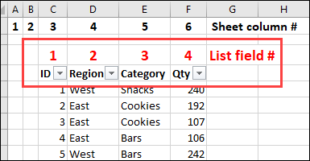

```vba
Sub HideArrowsExceptOne()
'hides all arrows except
' in specified field number
Dim c As Range
Dim rng As Range
Dim i As Long
Dim iShow As Long
Set rng = ActiveSheet.AutoFilter.Range.Rows(1)
i = 1
iShow = 2 'leave this field's arrow visible
Application.ScreenUpdating = False

For Each c In rng.Cells
    If i = iShow Then
        c.AutoFilter Field:=i, _
        Visibledropdown:=True
    Else
        c.AutoFilter Field:=i, _
        Visibledropdown:=False
    End If
    i = i + 1
Next

Application.ScreenUpdating = True
End Sub
```

隐藏部分箭头

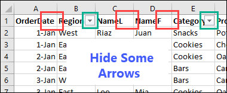

```vba
Sub HideArrowsSpecificFields()
    'hides arrows in specified fields
    Dim c As Range
    Dim i As Integer
    Dim rng As Range
    Set rng = ActiveSheet.AutoFilter.Range.Rows(1)
    i = 1
    Application.ScreenUpdating = False

    For Each c In rng.Cells
        Select Case i
            Case 1, 3, 4
            c.AutoFilter Field:=i, _
                Visibledropdown:=False
        Case Else
            c.AutoFilter Field:=i, _
                Visibledropdown:=True
        End Select
        i = i + 1
    Next

    Application.ScreenUpdating = True
End Sub
```


#### 5.4.4 复制所有的过滤后的数据

```vba
Sub CopyFilter()
    'by Tom Ogilvy
    Dim rng As Range
    Dim rng2 As Range

    With ActiveSheet.AutoFilter.Range
        On Error Resume Next
            ' 删选后的结果，删选后的行号即为：rng2.Row
            Set rng2 = .Offset(1, 0).Resize(.Rows.Count - 1, 1) _
            .SpecialCells(xlCellTypeVisible)
        On Error GoTo 0
    End With
    If rng2 Is Nothing Then
        MsgBox "No data to copy"
    Else
        Worksheets("Sheet2").Cells.Clear
        Set rng = ActiveSheet.AutoFilter.Range
        rng.Offset(1, 0).Resize(rng.Rows.Count - 1).Copy _
        Destination:=Worksheets("Sheet2").Range("A1")
    End If

    ActiveSheet.ShowAllData
End Sub
```


#### 5.4.5 检查是否有自动筛选：

可以打开立即窗口，即类似于控制台的 Immediate Window，快捷键：`Ctrl+G` ,查看如下code的
iARM的打印值。

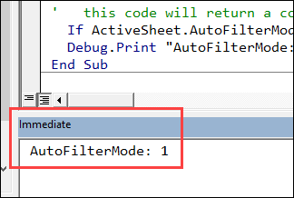

```vba
Sub CountSheetAutoFilters()
    Dim iARM As Long
    'counts all worksheet autofilters
    'even if all arrows are hidden
    If ActiveSheet.AutoFilterMode = True Then iARM = 1
    Debug.Print "AutoFilterMode: " & iARM
End Sub  
```


<a name="5.5"></a>
### 5.5 清理Excel数据相关操作

#### 5.5.1 清理单元格或Range中的内容

如若清空某个选中的单元格中的数据，使用的API为：`ClearContents`。   
示例：
```vba
Range("A1").Select
Selection.ClearContents
```


#### 5.5.2 清理/删除Excel中第一个标题行以外的所有行

同样使用ClearContents方法，主要是确定如何选中除第一行以外的表格。   
示例代码如下：
```vba
Sub ClearContentExceptFirst()
    Rows("2:" & Rows.Count).ClearContents
End Sub
```


#### 5.5.3  清理/删除Excel中某一些有空数据或者为0的数据

参数1：所要清理的工作簿名称
参数2：所要清理检查的所在列

```
Public Function RemoveIncorrectData(ByVal wsCheckedWorkSheetName As String, ByVal strCheckedColName)

    Dim shCheckIfRomoveSheet    As Worksheet    'The worksheet name of to be checked.
    Dim rwRecordRowMax          As Integer      'the max row number of all record in checked sheet.
    Dim i                       As Integer      'loop flag

    Set shCheckIfRomoveSheet = ThisWorkbook.Worksheets(wsCheckedWorkSheetName)

    shCheckIfRomoveSheet.Activate
    ' Get max original record row number
    rwRecordRowMax = shCheckIfRomoveSheet.Range("A1").End(xlDown).Row   ' 也可使用：Rows.Count

    'Delete rows with zero values
    For i = 2 To rwRecordRowMax Step 1
        If Cells(i, strCheckedColName) = "0" Then
            ' Remove incorrect record in worksheet
            Rows(i).EntireRow.Delete
        End If
    Next

End Function

```


<a name="5.6"></a>
### 5.6 循环遍历Excel中所有sheet

```
Dim wbOpenBook As Workbook
Dim i As Integer

Set wbOpenBook = Workbooks.Open("D:\test.xlsx")

wbOpenBook.Activate

For i = 1 To wbOpenBook.Worksheets.Count
    Set shCurrentWorkSheet = ActiveWorkbook.Worksheets(i)

    If shCurrentWorkSheet.Visible = True Then  ' 排除隐藏sheet，如果工作表为隐藏不进行遍历
        shCurrentWorkSheet.Activate
        Debug.Print shCurrentWorkSheet.Name
    End If
Next i

```


<a name="0x06"></a>
## 0x06 文件，文件夹等 相关常用操作

<a name="6.0"></a>
### 6.0 获取文件路径相关方法

返回应用程序完整路径
Application.Path

返回当前工作薄的路径
ThisWorkbook.Path

返回当前默认文件路径：
Application.DefaultFilePath

Application.ActiveWorkbook.Path   只返回路径
Application.ActiveWorkbook.FullName   返回路径及工作簿文件名
Application.ActiveWorkbook.Name   返回工作簿文件名


以下文件，文件夹等相关方法可自行封装成共通(common function)以便项目中使用。


<a name="6.1"></a>
### 6.1 判断文件，文件夹等是否存在

#1. 文件是否存在（File exists）：

1.1    使用 FileExists 判断是否存在
```vba
Sub FileExists()
    Dim fso as Scripting.FileSystemObject
    Set fso = CreateObject("Scripting.FileSystemObject")
    If fso.FileExists("D:\test.txt") = True Then
        MsgBox "The file is exists."
    Else
        MsgBox "The file isn't exists."
    End If
End Sub
```


1.2 使用Dir()判断文件是否存在

```
If Dir("C:\stamp.bat") = "" Then
    Debug.Print "文件未找到。"
End If
```
**注意：** VBA中两种判断文件是否存在的方法，使用 `FileExists` 和 `Dir`，期中
`FileExists`返回逻辑值，而 `Dir` 返回字符串，因此 `Dir` 不能参与逻辑值的比较。


#2. 文件夹是否存在（Folder exists）：
```vba
Sub FolderExists()
    Dim fso as Scripting.FileSystemObject
    Set fso = CreateObject("Scripting.FileSystemObject")
    If fso.FolderExists("D:\testFolder") = True Then
        MsgBox "The folder is exists."
    Else
        MsgBox "The folder isn't exists."
    End If
End Sub
```


#3. 硬盘是否存在（Drive exists）：
```vba
Sub DriveExists()
    Dim fso as Scripting.FileSystemObject
    Set fso = CreateObject("Scripting.FileSystemObject")
    If fso.DriveExists("D:\") = True Then
        MsgBox "The drive is exists."
    Else
        MsgBox "The drive isn't exists."
    End If
End Sub
```


<a name="6.2"></a>
### 6.2 文件相关操作
1. 文件复制（File copy）：
```vba
Sub CopyFile()
    Dim fso as Scripting.FileSystemObject
    Set fso = CreateObject("Scripting.FileSystemObject")
    fso.CopyFile "c:\Makro.txt", "c:\Macros\"
End Sub
```

2. 文件移动（File move）：
```vba
Sub MoveFile()
    Dim fso as Scripting.FileSystemObject
    Set fso = CreateObject("Scripting.FileSystemObject")
    fso.MoveFile "c:\*.txt", "c:\Documents and Settings\"
End Sub
```


3. 文件删除（File delete）：
```vba
    Sub DeleteFile()
    Dim fso
    Set fso = CreateObject("Scripting.FileSystemObject")
    fso.DeleteFile "c:\Documents and Settings\Macros\Makro.txt"
End Sub
```


4. 文件序号取得 FreeFile 函数

`FreeFile`函数返回一个整数，即表示可由 `Open` 语句使用的文件标识符号句柄。

语法：FreeFile[(rangenumber)]   
参数介绍：rangenumber 0 或 1 指定可能，它指定要返回的下一个文件编号所属的范围，   
参数num=0，返回1~255 (含) 范围内的文件号。   

参数num=1，返回一个范围为 256–511 的文件号。   

示例：   
```
Dim m As Integer, n As Integer, buf As String
m = FreeFile
Open D:\Articles\2019\File 1.txt For Input As m
Line Input #m, buf
n = FreeFile
Open D:\Articles\2019\File 2.txt For Input As n
Print #m, buf
Close m
Close n

'------------------------------------------------------------------------

Dim MyIndex, FileNumber
For MyIndex = 1 To 5         ' Loop 5 times.
    FileNumber = FreeFile    ' Get unused file

    Open "TEST" & MyIndex For Output As #FileNumber    ' Create file name.
    Write #FileNumber, "This is a sample."             ' Output text.
    Close #FileNumber                                  ' Close file.
Next MyIndex
```


5. EOF 函数

EOF函数 在对文件进行读取时，用于确认读取位置是否到达文件末尾。到达文件末尾时返回真(true)。

语法：EOF(FileNumber)   
返回值：Boolean


示例1：

```
Sub sample_eof()
    Dim FileNumber      As Integer
    Dim FilePath        As String
    Dim InputData       As String

    '使用可能なファイル番号を取得します。
    FileNumber = FreeFile

    'このマクロが組み込まれているエクセルファイルと
    '同一フォルダ内の"test.txt"を入力とします。
    FilePath = ThisWorkbook.Path & "\test.txt"

    '入力ファイルの存在チェック
    If Dir(FilePath) = "" Then
        MsgBox "入力ファイルが存在しません。", vbCritical
        '入力ファイルがない場合はここで処理を終了させます。
        End
    End If

    'テキストファイルを入力モードで開きます。
    Open FilePath For Input As #FileNumber

    'ファイルの終わりになるまで
    'ファイル内のデータを1行ずつ読み込みます。
    Do While Not EOF(FileNumber)
        Line Input #FileNumber, InputData
        'イミディエイトウィンドウへ表示
        Debug.Print InputData
    Loop

    Close #FileNumber

    MsgBox "処理が終了しました。", vbInformation
End Sub
```


示例2：

```
Dim intFNum      As Integer
Dim strExcelDir  As String
Dim strInputFile As String
Dim strInputData As String

strExcelDir = ThisWorkbook.Path
strInputFile = strExcelDir & "\" ActiveSheet.Cells("1", "E").Value
intFNum = FreeFile()

Open strInputFile For Input As intFNum
  ... 'other logic

  Do While Not EOF(intFNum)              ' Check for end of file.
      Line Input #intFNum, strInputData  ' Read line of data.
      Debug.Print strInputData           ' Print to the Immediate window.
  Loop
  Close #intFNum                         ' Close file.
```


6. 获取C盘根目录下的所有文件名并且将每个文件名写入工作表

```
Sub GetAllFiles()
    Dim strFiles As String
    Dim intNextRow As Integer
    intNextRow = 1

    ' next row index
    With Worksheets("Sheet1").Range("A1")
        strFiles = Dir("C:\", vbNormal)
        .Value = strFiles
        Do While strFiles <> ""
            strFiles = Dir
            .Offset(intNextRow, 0).Value = strFiles
            intNextRow = intNextRow + 1
        Loop
    End With
End Sub
```


7. 获取文件大小（FileLen函数和CreateObject.GetFile.Size）:


使用FileLen函数：
```
Sub getTotalFileSizeByFileLen()
    Dim iniFiles As String
    Dim allBytes As Long
    iniFiles = Dir("C:\WINDOWS\*.ini")
    allBytes = 0
    Do While iniFiles <> ""
        allBytes = allBytes + FileLen("C:\WINDOWS\" & iniFiles)
        iniFiles = Dir
    Loop
    Debug.Print "Total bytes: " & allBytes
End Sub
```

使用CreateObject.GetFile.Size：
```
Sub GetFileSize()
    Dim fs, f, strFilename
    strFilename = ThisWorkbook.Path & "\1.txt"
    Set fs = CreateObject("Scripting.FileSystemObject")
    Set f = fs.GetFile(strFilename)
    Debug.Print "file size:" & CStr(CDbl(f.Size) / 1024# / 1024#) & "MB"
    Debug.Print "file LastModified:" & f.DateLastModified
End Sub
```


8. 另存某一个工作簿sheet为CSV文件

保存CSV文件位置为当前VBA Tool同文件夹
```
Public Function SaveAsTemplateData2CSVFile(ByVal wsSavedWorkSheetName As String, ByVal strCSVFileName As String)
    Dim strSavePath As String

    strSavePath = ThisWorkbook.Path

    Debug.Print strSavePath
    'Close warning message.
    Application.DisplayAlerts = False   ' 关闭提示警告

    'Copies the sheet to a new workbook:
    Worksheets(wsSavedWorkSheetName).Copy

    'The new workbook becomes Activeworkbook:
    With ActiveWorkbook
        'Saves the new workbook to given folder / filename:
        .SaveAs fileName:= _
            strSavePath & "\" & strCSVFileName, _
            FileFormat:=xlCSV, _
            CreateBackup:=False
        'Closes the file
        .Close False
    End With

    Application.DisplayAlerts = True    ' 打开提示警告
End Function
```


<a name="6.3"></a>
### 6.3 文件夹相关操作

1. 创建文件夹（Folder create）：
```
Sub CreateFolder()
    Dim fso as Scripting.FileSystemObject
    Set fso = CreateObject("Scripting.FileSystemObject")
    fso.CreateFolder "c:\Documents and Settings\NewFolder"
End Sub
```

2. 复制文件夹（Folder copy）：
```
Sub CopyFolder()
    Dim fso as Scripting.FileSystemObject
    Set fso = CreateObject("Scripting.FileSystemObject")
    fso.CopyFolder "C:\Documents and Settings\NewFolder", "C:\"
End Sub
```

3. 移动文件夹（Folder move）：
```
Sub MoveFolder()
    Dim fso as Scripting.FileSystemObject
    Set fso = CreateObject("Scripting.FileSystemObject")
    fso.MoveFolder "C:\Documents and Settings\NewFolder", "C:\"
End Sub
```

4. 删除文件夹（Folder delete）：
```
Sub DeleteFolder()
    Dim fso as Scripting.FileSystemObject
    Set fso = CreateObject("Scripting.FileSystemObject")
    fso.DeleteFolder "C:\Documents and Settings\NewFolder"
End Sub
```

5. 获取文件夹大小：
```
Sub fldsize()
    Dim fso, fld
    Set fso = CreateObject("scripting.filesystemobject")
    Set fld = fso.getfolder(ThisWorkbook.Path)  ' 获取文件夹
    ' Set fld = fso.GetFile(ThisWorkbook.Path  & "\1.txt")  ' 获取文件
    MsgBox "Total size:" & fld.Size / 1024 & "KB"
End Sub
```


<a name="6.4"></a>
### 6.4 GetOpenFilename获取文件名

语法：GetOpenFilename (FileFilter, FilterIndex, Title, ButtonText, MultiSelect)

参数介绍：

`FileFilter`	可选项		指定文件筛选条件的字符串。
`FilterIndex`	可选项		指定默认文件筛选条件的索引号，编号从 1 直到 FileFilter 中指定的筛选器编号。 如果此参数被省略或大于存在的筛选器数，使用的是第一个文件筛选器。
`Title`	        可选项		指定对话框的标题。 如果此参数被省略，标题为“打开”。
`ButtonText`	可选项		仅限 Macintosh。
`MultiSelect`	可选项     若为 True，允许选择多个文件名。 若为 False，仅允许选择一个文件名。 默认值为 False。


利用`GetOpenFilename`多选文件，返回所有文件名
```
Sub ImportOriginalDataFiles()

    '-------------------------------------
    ' Define all variables
    '-------------------------------------
    Dim strFileNames As Variant     ' import report files
    Dim i As Integer                ' the variable of import file loop flag

    ' Remove exist filename of imported before.
    ThisWorkbook.ActiveSheet.Range("C9", "D30").Select
    Selection.ClearContents

    ThisWorkbook.ActiveSheet.Range("A1").Select ' Reset focus to "A1"

    ' Disable updating on screen.
    'Application.ScreenUpdating = False

    ' Call ShowWarning method to alert message to User.
    Call ShowWarning

    ' To prevent any error when If user don't select any input file.
    On Error Resume Next

    ' Get All imported file array.
    strFileNames = Application.GetOpenFilename("Excel Files(*.xls*), *.xlsx*", , "Please Select Files", , True)


    With ThisWorkbook.ActiveSheet
        If strFileNames <> False Then   ' To prevent any error when If user don't select any input file.
            For i = 1 To UBound(strFileNames)
                Debug.Print strFileNames(i)
                .Cells(8 + i, 3).Value = CStr(i) & "."            ' Write No. in C9 cell
                .Cells(8 + i, 4).Value = strFileNames(i)    ' Write file path in D9 cell
            Next i
        Else
            MsgBox (STR_LOCAL_MSG_REQUIRED_INPUT)
        End If
        .Range("A1").Select ' Reset focus to "A1"
    End With

    ' Avalible updating on screen.
    'Application.ScreenUpdating = True

End Sub
```


<a name="6.9"></a>
### 6.9 其他操作（获取文件名等）

1. 获取文件全名，带有后缀（Get file name）
```vba
Sub GetFileName()
    Dim fso as Scripting.FileSystemObject
    Set fso = CreateObject("Scripting.FileSystemObject")
    MsgBox fso.GetFileName("c:\Documents and Settings\Makro.txt")   ' Makro.txt
End Sub
```

2. 获取文件名，无后缀（Get base name）
```vba
Sub GetBaseName()
    Dim fso as Scripting.FileSystemObject
    Set fso = CreateObject("Scripting.FileSystemObject")
    MsgBox fso.GetBaseName("c:\Documents and Settings\Makro.txt")   ' Makro
End Sub
```

3. 获取文件后缀格式（Get extension name）
```vba
Sub GetExtensionName()
    Dim fso as Scripting.FileSystemObject
    Set fso = CreateObject("Scripting.FileSystemObject")
    MsgBox fso.GetExtensionName("c:\Documents and Settings\Makro.txt")  ' txt
End Sub
```

4. 获取盘符名（Get drive name）
```vba
Sub GetDriveName()
    Dim fso as Scripting.FileSystemObject
    Set fso = CreateObject("Scripting.FileSystemObject")
    MsgBox fso.GetDriveName("c:\Documents and Settings\Makro.txt")  ' c:
End Sub
```


<a name="0x07"></a>
## 0x07 日期和时间 相关函数


<a name="7.1"></a>
### 7.1 Date, Time, Now 函数

`Date` 函数返回当前的系统日期。   
`Time` 函数返回当前的系统时间。   
`Now`  函数返回当前的系统日期和时间。   

**注意：** 如果同时读取 Date、Time 以及 Now，那么 Now = Date + Time，但是实际上，我们不可能同时调用这三个函数，因为执行完一个函数之后，才能执行另一个函数，所以如果您在程序中必需同时取得当时的日期和时间，必需调用 Now，再利用 DateVale 及 TimeValue 分别取出日期和时间。


```
Private Sub CommandButton2_Click()    
    MsgBox Now    ' 20/05/2020 16:28:04
    MsgBox Date   ' 20/05/2020
    MsgBox Time   ' 16:28:39
End Sub
```

<a name="7.2"></a>
### 7.2 日期函数：Year, Month, Day, 季度

`Year`, `Month`, `Day` 函数分别返回 **数字格式** 的年，月，日。

```
Dim exampleDate As Date

exampleDate = DateValue("May 19, 2020")

MsgBox Year(exampleDate)  ' 2020
MsgBox Month(exampleDate) ' 5
MsgBox Day(exampleDate)   ' 19
```

**季度(Quarter)函数**：

1. 返回季度公式一：

    `=ROUNDUP(MONTH(A2)/3,0)`    
    解释：MONTH(A2)，结果为12。MONTH函数的用法是返回日期中的月份，它是介于 1(一月)和12(十二月)之间的整数。    
    MONTH(A2)/3，结果为4。    
    ROUNDUP函数的用法是向上舍入。当第二参数为0，表示向上舍入到最接近的整数。比如=ROUNDUP(0.333333333333333,0)，结果为1。第二参数为0，通常可以简写，因此上面这个返回季度的公式也可以这样写：`=ROUNDUP(MONTH(A2)/3,)`

2. 返回季度公式二：

    `=INT((MONTH(A2)+2)/3)`    
    INT是向下取整函数，和公式一的写法类似。

3. 返回季度公式三：

    `=CEILING(MONTH(A2)/3,1)`    
    CEILING函数也是向上舍入函数之一

4. 返回季度公式四：

    `=LOOKUP(MONTH(A2),{1,4,7,10},{1,2,3,4})`
    解释：公式中使用了LOOKUP函数的向量形式。LOOKUP 函数的向量形式在第一个单行或单列区域中查找值，然后返回第二个单行或单列区域中相同位置的值。如果找不到，那么它将与其中小于或等于查找值的最大值匹配。如MONTH(A2)返回“12”，在“{1,4,7,10}”中找不到，则与接近“12”的最小值（“10”）匹配，返回“4”。

5. 返回季度公式五：

    `=LEN(2^MONTH(A2))`


**Excel Formula 显示当前日期时分秒**

```
# 显示格式为：02/17/2022 11:17:21

=TEXT(NOW(),"mm/dd/yyyy hh:mm:ss")
```


<a name="7.3"></a>
### 7.3 CDate 和 DateValue 函数
VBA中的CDate和DateValue的区别(Difference between CDate and DateValue in VBA)

1. `CDate` 函数可把一个合法的日期和时间 *表达式* 转换为 `Date` 类型，并返回结果。

**提示：** 请使用 [IsDate](#7.4) 函数来判断 date 是否可被转换为日期或时间。

※　举例参照如下小节

2. DateValue(date) 函数 返回一Date类型数据

*date* 参数通常是一个字符串表达式, 表示从100年1月1日到9999年12月31日之间的日期。 但是，*date* 还可是任何表示该范围内的日期、时间或日期和时间的表达式。

**备注（Reference From [MSDN](https://docs.microsoft.com/zh-cn/office/vba/language/reference/user-interface-help/datevalue-function)）：** 如果 *date* 是一个仅包含由有效日期分隔符分隔的数字的字符串, 则DateValue将根据您为系统指定的短日期格式识别月、日和年的顺序。 DateValue 还能清楚地识别包含月名称（长名称或简写形式）的日期。 例如，除了识别 12/30/1991 和 12/30/91 之外，DateValue 还识别 December 30, 1991 和 Dec 30, 1991。
如果省略 date 的年部分，则 DateValue 将使用计算机系统日期中的当前年。
如果 date 参数包含时间信息，则 DateValue 将不会返回它。 但是，如果 date 包含的时间信息无效（如“89:98”），则将出错。


CDate与DateValue的举例：   
```
' 举例1：
d1 = "April 22, 2001"
d2 = "6:15:45 PM"
d3 = "2014-07-24 15:43:06"
d4 = "29-Jan-21"

If IsDate(d1) And IsDate(d2) And IsDate(d3) Then
    MsgBox CDate(d1)      ' 22/04/2020
    MsgBox CDate(d2)      ' 18:15:45
    MsgBox CDate(d3)      ' 24/07/2014 15:43:06
    MsgBox CDate(d4)      ' 29/01/2021

    MsgBox DateValue(d1)  ' 22/04/2020
    MsgBox DateValue(d2)  ' 00:00:00
    MsgBox DateValue(d3)  ' 24/07/2014
End If
```

```
' 举例2：
MsgBox CDate(43972)             ' 5/21/2020
MsgBox CDate("12/25/2020")      ' 1/15/2014

MsgBox DateValue("12/25/2020")  ' 1/15/2014
MsgBox DateValue(43972)         ' Throws a Type mismatch error(Run-time error 13)
```


**总结：** CDate和DateValue的区别：   
* 从上述 *举例1* 代码结果总结出，`DateValue` 只返回一个Date类型结果，而`CDate`返回结果将保留日期和时间，当参数为一个时间类型的时候，`DateValue` 只能返回一个 `00:00:00`的结果。

* 从上述 *举例2* 代码结果总结出，另外，`DateValue` (或`TimeValue`)只接受 `String` 类型的参数，而 `CDate` 也可以处理 **数字** 。可使用`CDate(Int(num))`和`CDate(num - Int(num))`函数。


**注意（09/23/2021 16:46 Sekito Lv 追加）：** 如果无法使用`CDate`进行处理日期字符串的时候，又要返回Date类型日期，需要使用 `DateSerial`、结合`Mid`、`Right`或者`Left` 进行字符串处理。</br>

举例如下：
```
Range("E" & i).Value = DateSerial(Mid(Range("E" & i).Value, 7, 4), Mid(Range("E" & i).Value, 4, 2), Left(Range("E" & i).Value, 2))
```


<a name="7.4"></a>
### 7.4 IsDate 函数
`IsDate` 函数返回一个布尔值，用于判断一个表达式是否可被转换为日期。如果表达式是日期，或可被转换为日期，则返回 True 。否则，返回 False 。

**注释：** `IsDate` 函数使用本地设置来检测字符串是否可以转换为日期。在 Windows 中, 有效日期的范围是公元100年1月1日至公元9999年12月31日;各操作系统的范围各不相同。

示例：   
```
Dim MyVar, MyCheck
MyVar = "04/28/2014"        ' Assign valid date value.
MyCheck = IsDate(MyVar)     ' Returns True.

MyVar = "April 28, 2014"    ' Assign valid date value.
MyCheck = IsDate(MyVar)     ' Returns True.

MyVar = "13/32/2014"        ' Assign invalid date value.
MyCheck = IsDate(MyVar)     ' Returns False.

MyVar = "04.28.14"          ' Assign valid time value.
MyCheck = IsDate(MyVar)     ' Returns True.

MyVar = "04.28.2014"        ' Assign invalid time value.
MyCheck = IsDate(MyVar)     ' Returns False.

MyVar = "Hello World!"      ' Assign invalid time value.
MyCheck = IsDate(MyVar)     ' Returns False.
```


<a name="7.5"></a>
### 7.5 DateAdd 函数

`DateAdd` 函数可返回已添加指定时间间隔的日期。

语法：DateAdd(*interval, number, date*)

| 参数 | 描述 |
|--------|-------|
|interval|必需的。需要增加的时间间隔。</br>可采用下面的值：</br>yyyy - 年   </br>q - 季度          </br>m - 月          </br>y - 当年的第几天          </br>d - 日          </br>w - 当周的第几天          </br>ww - 周          </br>h - 小时          </br>n - 分钟          </br>s - 秒|
|number|必需的。需要添加的时间间隔的数目。可对未来的日期使用正值，对过去的日期使用负值。|
|date|必需的。代表被添加的时间间隔的日期的变量或文字。|

示例：

```
DateAdd("m",1,"31-Jan-01")    ' 2/28/2001
DateAdd("m",1,"31-Jan-00")    ' 2/29/2000
DateAdd("m",-1,"31-Jan-01")   ' 12/31/2000
```

在此情况下，DateAdd 返回 2001 年 2 月 28 日，而不是 2001 年 2 月 31 日。 如果 date 为 2000 年 1 月 31 日，则它将返回 2000 年 2 月 29 日，因为 2000 年是闰年。

如果计算的日期位于年份数 100 前（即，你减去的年份数大于 date 中的年份，则出现错误。

如果 *number* 不是 Long 值，则在计算之前将其 **四舍五入** 到最接近的整数。

**另外：** 在使用“w”时间间隔（包括一周的所有天，从星期日到星期六）向日期添加天数时，DateAdd 函数会向日期添加您指定的总天数，而不是像您预期的那样仅向日期添加工作日（从星期一到星期五）数。


<a name="7.6"></a>
### 7.6 Sleep 函数
VBA中同样有类似Java中的线程等待函数`Sleep`。同样Sleep中的参数为毫秒，也就是如果你想在程序中停顿10秒，那么参数应该传递10000。

使用`Sleep`前，要在代码前引用 **32位动态链接库文件(`kernel32`)**。

```
#If VBA7 Then
    Public Declare PtrSafe Sub Sleep Lib "kernel32" (ByVal dwMilliseconds As LongPtr)
'For 64-Bit versions of Excel
#Else
    Public Declare PtrSafe Sub Sleep Lib "kernel32" (ByVal dwMilliseconds As Long)
'For 32-Bit versions of Excel
#End If
```

使用`Sleep`函数示例：

```
Sub SleepExample()

    Dim StartTime As String
    Dim EndTime As String

    StartTime = Time
    MsgBox StartTime

    Sleep (10 * 1000)

    EndTime = Time
    MsgBox EndTime

End Sub
```


<a name="0x08"></a>
## 0x08 消息框的函数 MsgBox 

VBA 中的 MsgBox 函数用于显示消息框，允许你向用户显示文本信息，并接收用户的响应。以下是 MsgBox 函数的常见用法和参数：

```
MsgBox(prompt, [buttons], [title], [helpfile], [context])
```
* prompt：必需参数，表示要显示的文本消息。可以是一个字符串表达式或变量。
* buttons：可选参数，用于指定消息框的按钮类型。可以使用以下常量之一或它们的组合：
    * vbOKOnly：只显示 "确定" 按钮。
    * vbOKCancel：显示 "确定" 和 "取消" 按钮。
    * vbAbortRetryIgnore：显示 "中止"、"重试" 和 "忽略" 按钮。
    * vbYesNoCancel：显示 "是"、"否" 和 "取消" 按钮。
    * vbYesNo：显示 "是" 和 "否" 按钮。
    * vbRetryCancel：显示 "重试" 和 "取消" 按钮。
* title：可选参数，表示消息框的标题栏文本。如果省略，则不显示标题。
* helpfile：可选参数，表示与消息框相关的帮助文件的名称。如果省略，则不显示帮助按钮。
* context：可选参数，表示与帮助文件相关的上下文 ID。如果 helpfile 参数不为空，则 context 参数必须提供。

MsgBox 函数的返回值是一个整数，表示用户的响应或按钮的标识符。常用的返回值（按钮标识符）常量包括：

* vbOK：表示用户点击了 "确定" 按钮。
* vbCancel：表示用户点击了 "取消" 按钮。
* vbYes：表示用户点击了 "是" 按钮。
* vbNo：表示用户点击了 "否" 按钮。
* vbRetry：表示用户点击了 "重试" 按钮。
* vbAbort：表示用户点击了 "中止" 按钮。
* vbIgnore：表示用户点击了 "忽略" 按钮。

根据你的需求，你可以根据提示文本、按钮类型和其他选项定制消息框的外观和行为。

请注意，VBA 中的 MsgBox 函数是一个简单的消息框显示功能，如果需要更高级的用户界面交互功能，可以考虑使用用户窗体或自定义用户界面控件。


下面进行几个常见举例：    

1. 显示简单的消息框：    

```
MsgBox "Hello, World!" ' 显示消息框并显示 "Hello, World!"
```

2. 显示带有标题的消息框：    

```
MsgBox "操作成功！", vbInformation, "提示" ' 显示一个带有标题 "提示" 的消息框，并显示 "操作成功！"
```

3. 显示带有按钮和图标的消息框，并根据用户的选择执行不同的操作：    

```
Dim result As Integer
result = MsgBox("是否保存更改？", vbYesNoCancel + vbQuestion, "确认") ' 显示一个带有 Yes、No 和 Cancel 按钮以及问号图标的消息框，并带有标题 "确认"
If result = vbYes Then
    ' 用户选择了 "是" 按钮
    ' 执行保存操作
    MsgBox "保存成功！", vbInformation, "提示"
ElseIf result = vbNo Then
    ' 用户选择了 "否" 按钮
    ' 执行其他操作
    MsgBox "操作已取消。", vbInformation, "提示"
ElseIf result = vbCancel Then
    ' 用户选择了 "取消" 按钮
    ' 执行取消操作
    MsgBox "操作已取消。", vbInformation, "提示"
End If

```

4. 显示带有默认按钮和返回值的消息框：    

```
Dim response As Integer
response = MsgBox("请选择一个选项:", vbYesNoCancel + vbQuestion + vbDefaultButton2, "选择")
If response = vbYes Then
    ' 用户选择了 "是" 按钮
    MsgBox "您选择了 '是'。", vbInformation, "提示"
ElseIf response = vbNo Then
    ' 用户选择了 "否" 按钮
    MsgBox "您选择了 '否'。", vbInformation, "提示"
ElseIf response = vbCancel Then
    ' 用户选择了 "取消" 按钮
    MsgBox "您选择了 '取消'。", vbInformation, "提示"
End If

```


<a name="0x10"></a>
## 0x10 VBA 转换函数一览

* [Type conversion functions](type-conversion-functions.md)
- [10.1 CBool](type-conversion-functions.md#CBool-function-example)
- [10.2 CByte](type-conversion-functions.md#CByte-function-example)
- [10.3 CCur](type-conversion-functions.md#CCur-function-example)
- [10.4 CDate](type-conversion-functions.md#CDate-function-example)
- [10.5 CDbl](type-conversion-functions.md#CDbl-function-example)
- [10.6 CDec](type-conversion-functions.md#CDec-function-example)
- [10.7 CInt](type-conversion-functions.md#CInt-function-example)
- [10.8 CLng](type-conversion-functions.md#CLng-function-example)
- [10.9 CLngLng](type-conversion-functions.md) (Valid on 64-bit platforms only.)
- [10.10 CLngPtr](type-conversion-functions.md)
- [10.11 CSng](type-conversion-functions.md#CSng-function-example)
- [10.12 CStr](type-conversion-functions.md#CStr-function-example)
- [10.13 CVar](type-conversion-functions.md#CVar-function-example)


<a name="10.1"></a>
### 10.1 取整函数的使用


VBA取整函数有好几个，用法也不同，有的还可以在工作表中使用，下面根据需求分别说明：

**1、四舍五入取整，一般用于取近似数**

（1）CInt：只能在VBA中使用

```
    CInt(12.56) = 13
    CInt(12.46) = 12
    CInt(-12.56) = -13
    CInt(-12.46) = -12
```

（2）Round：在VBA中使用和CInt相同

```
Round(12.56)=13
Round(12.46)=12
Round(-12.56)=-13
Round(-12.46)=-12
```

此函数实际上有两个参数，第二个参数表示取小数的位数，或略表示取整，即小数位数为0。该函数还可以在工作表中使用，使用时两个参数必须写全，即：

```
Round(12.56,0)=13
Round(12.56,1)=12.6
```

**2、取整数部分，小数舍弃，常用于取整数和余数**

（1）Fix：只能在VBA中使用

```
    Fix(12.56)=12
    Fix(12.46)=12
    Fix(-12.56)=-12
    Fix(-12.46)=-12
```

（2）Int：在VBA和工作表中都可以使用

此函数取正数时和Fix相同，负数时往绝对值高的方向取，就是说，取小于其值得整数，

```
Int(12.56)=12
Int(12.46)=12
Int(-12.56)=-13
Int(-12.46)=-13
```

举例：买50个鸡蛋，12个鸡蛋一盒，那么需要Fix(50/12)=4盒，零头50 mod 12=2个</br>

**3、往上取整，只要有小数，整数部分就加1，常用于资费计算**

邮件资费定价时常用不足500g按500g计算，即501g相当于2个500g计算资费。本功能VBA没有专门的函数，可以使用 `-(Int(-x))` 实现，例如：

```
-(Int(-12.56))  ' = 13
-(Int(-12.46))  ' = 13
-(Int(-12.01))  ' = 13
-(Int(-12))     ' = 12

```

不过，工作表中还是有一个Ceiling函数可以实现这个功能，Ceiling(12.01, 1)=13，第二个参数1表示舍入到最近的整数。VBA中可以用下列方式引用：

```
a = Application.Ceiling(12.06, 1)         ' a = 13
```

Ceiling函数功能比较复杂，这儿就不详细介绍了。


**4、关于Round函数进行四舍五入**

VBA中Round函数进行四舍五入并不是逢5就入，例如：

`round(0.5)=0`、 `round(1.5)=2` 、 `round(2.5)=2` 、`round(3.5)= 4` 、`round(4.5)=4`，难到还分奇偶？答案是确实分奇偶，在VBA中Round函数是采用“银行家舍入”，建议大家在VBA中慎重使用Round函数来四舍五入。什么是“银行家舍入”呢，定义如下：
“四舍六入五考虑，五后非零就进一，五后为零看奇偶，五前为偶应舍去，五前为奇要进一”。这个四舍五入法是一个国际标准，大部分的编程软件都使用的是这种方法，据说国际上一般都是用这种方法的。</br>
如果在Excel VBA中进行四舍五入处理，也可以直接调用Excel工作表函数，达到直接四舍五入的目的Application.Round(A, B)，例如，下面例句可以看出运行效果：

```
    a = Application.Round(12.5, 0)      'a=13
    b = Round(12.5)                     'b=12
```


<a name="0x90"></a>
## 0x90 VBA Best Practices
1. Always have Option Explicit at the top of your code modules to
enforce variable declaration.
2. Never write procedures and functions that are longer than a full screen
as these are hard to understand. Procedures should fit on one screen -
ie be 40-50 lines long maximum.- ie be 40-50 lines long maximum.
3. Always prefix your variables so you can quickly identify their datatype.
4. Never use the Variant datatype unless absolutely necessary.</br>
**注**：尽量不要使用`Variant`，要显示的声明具体的数据类型。Variant是VBA中的一种特殊类型，
所有没有声明的数据类型的变量都默认是Variant型。但Variant型所占的存储空间远大于其他的
数据类型，所以除非必要，否则应该避免申明变量为Variant型。
5. Always use the keyword "**Call**" to call your procedures.
6. Always put your arguments in parentheses.
7. Never use Global variables unless absolutely necessary.
Pass parameters ByVal (ByRef is the default) - only use ByRef where
you intend to modify the parameter and pass the change back to the caller.
8. Always use tabs to indent your code to bring structure, never use spaces.
9. Add "value added" comments which explain why, do not add trivial comments.
10. Always add an Error Handler to every procedure and function.
11. Use the line continuation character to make your code more readable and
to reduce the amount of scrolling.
12. Never use the Option Base or Option Compare statements.

**More reference:** [VBA Code Guidelines/Best-practices](CodingStandards.md)

<a name="0x91"></a>
## 0x91 Trouble shooting


<a name="91.1"></a>
### 91.1 调试经验 Excel点击保存时总是弹出隐私信息警告（Privacy Warning:this document contains macros...）的解决方法

警告信息：
> Privacy Warning:this document contains macros, ActiveX controls, XML expansion pack information or web components. these may include personal information that cannot be removed by the document Inspector.

菜单依次点击：</br>
File → Options → Trust Center → Trust Center Settings → Privacy Options
取消勾选(Uncheck) "Remove personal information from file properties on save" 选项

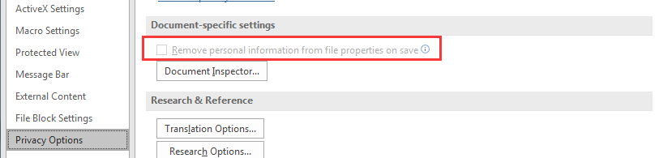


<a name="91.2"></a>
### 91.2 清除Excel数据透视表中过滤器缓存（旧项目）

如下图所示，根据数据范围创建数据透视表时，从源范围中删除数据后，即使刷新数据透视表，旧项目仍将存在于数据透视表的下拉菜单中。 如果要从数据透视表的下拉菜单中删除所有旧项目，可参照如下两种方法：


**1. 通过更改选项来清除数据透视表中的过滤器缓存（旧项目）**

Step1: 右键单击数据透视表中的任何单元格，然后单击 数据透视表选项 从上下文菜单。 看截图：   

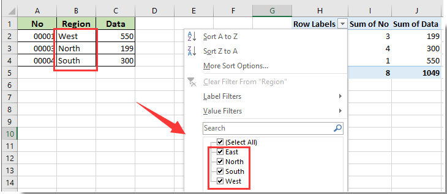

Step2: 在里面 数据透视表选项 对话框中，单击 **数据** 标签，选择 没有 来自 **每个字段要保留的项目数量** 下拉列表，然后单击 OK 按钮。   

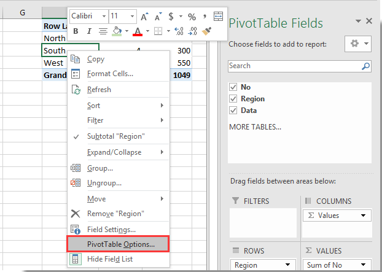

Step3: 右键单击“数据透视表”单元格，然后单击 **刷新** 从右键菜单。 看截图：   

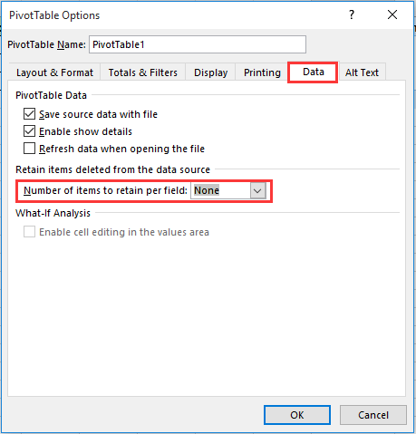

然后你可以看到旧的项目从数据透视表的下拉菜单中删除，如下图所示。   

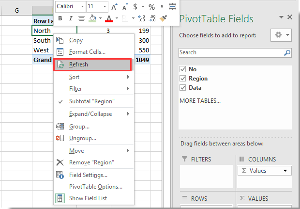


**2. 使用VBA代码清除所有数据透视表中的过滤器缓存（旧项目）**

在 **项目** 窗格打开 **ThisWorkbook（Code）** 窗口，然后将下面的VBA代码复制并粘贴到窗口中。
```VBA
Private Sub Workbook_Open()
    Dim xPt As PivotTable
    Dim xWs As Worksheet
    Dim xPc As PivotCache
    Application.ScreenUpdating = False
    For Each xWs In ActiveWorkbook.Worksheets
        For Each xPt In xWs.PivotTables
            xPt.PivotCache.MissingItemsLimit = xlMissingItemsNone
        Next xPt
    Next xWs
    For Each xPc In ActiveWorkbook.PivotCaches
        On Error Resume Next
        xPc.Refresh
    Next xPc
    Application.ScreenUpdating = True
End Sub
```


按 F5 键来运行代码，然后从活动工作簿中的所有数据透视表的下拉菜单中立即删除旧项目。


<a name="8.3"></a>
### 91.3 解决办法：The macros in this project are disabled.  Please refer to the online help or documentation of the host application to determine how to enable macros.

错误现象： Excel2016（365）运行macro宏时，弹出标题警告↓   

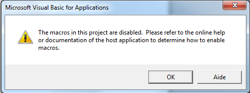   

解决办法：   
step1：先确认Excel的设置是否正确
依次点击 File >> Options >> Trust Center >> Trust Center Settings >> Macro Settings 按照如下图所示设置：   

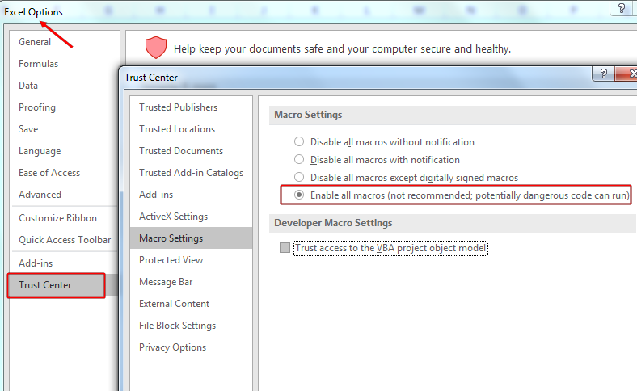   

step2：确认自己机器的安全级别   
一般如果按照step1设置后再次运行macro宏依然弹出警告，另一种情况就是你自己的机器（远程PC/Server/VDI等）自身的安全级别过高造成的。   
打开浏览器依次点击 Tools >> Internet options >> Security >> Customer level...  将安全级别从 **高(High)** 改成 **中(Medium)**。   

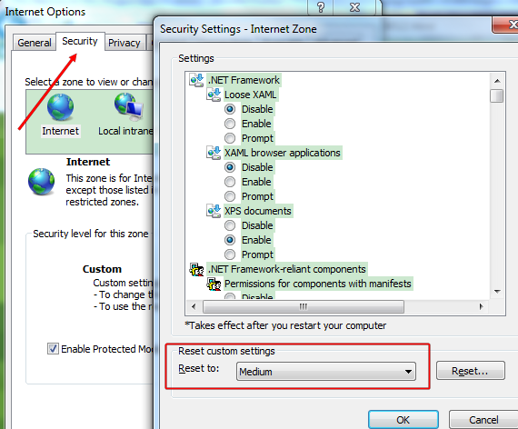   


<a name="91.7"></a>
### 91.7 Excel每次保存时都弹出警告：”此文档中包含宏、Activex控件、XML扩展包信息“（office 2007/2010/365+）

**1.** office 2003版本：

 依次点击：“工具” → “选项" → "在安全" 选项卡中 **勾选** ”保存时从文件属性中删除个人信息”。

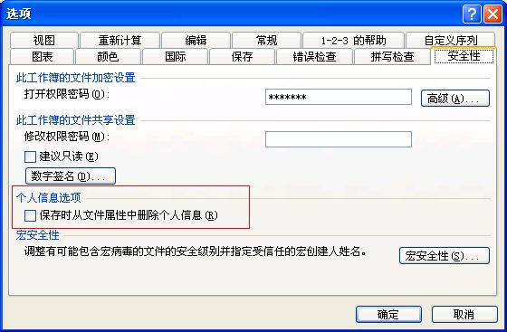


**2.** office 2007/2010/365+版本：

单击“Office按钮（或文件菜单） → Excel选项（或选项） → 信任中心”，单击“信任中心设置”按钮，选择“个人信息选项”（隐私选项Privacy Options），在“文档特定设置”下 **取消** 勾选 “保存时从文件属性中删除个人信息” 后确定。

**注意：** 该选项仅对当前工作簿有效。另外，新建工作簿时该选项为灰色不可用，只有用“文档检查器”检查了文档并删除了个人信息后该选项才可用。

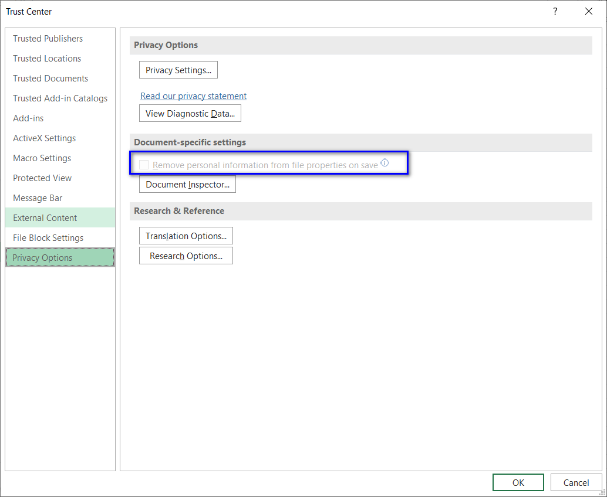


<a name="91.8"></a>
### 91.8 解决办法：使用.xlam宏文件执行VBA程序时，操作excel无任何反应

今天小伙伴遇到一个问题，自己做了一个xlam的工具，实现更改当前excel的所有sheet名称，但是当点击工具button的时候程序无反应。   
代码如下：

```
Sub demo45()
    Dim ws As Worksheet          ' 把ws 定义为一个工作表对象
    For Each ws In Worksheets    ' 用for each 遍历对象集合
    ws.Name = "Test_" & ws.Name  ' 改名
    Next
End Sub
```

原因及解决办法：   
首先看代码并没有什么问题，调查的时候在循环语句中添加了ThisWorkbook指定，
但执行macro的时候发现sheet名字依然没有改变。在无意间看 工程资源管理器（Project Explore）
的时候，发现VBAProject(XXX.xlam)中的默认Sheet1的名字被改变，这也就说明了，不是VBA程序
没有起作用，而是程序在执行的时候默认操作了xlam工作簿。后修改程序中的默认制定工作簿语句
为：`ActiveWorkbook` marco可以正常执行操作，问题得以解决。


<a name="91.9"></a>
### 91.9 解决办法：解决办法：复位Excel到A1单元格，锁定缩放比例85%
1. 创建.xlam文件
2. 在 .xlam文件内编辑如下代码：
```
Sub MacroZoom285()
    Dim i As Integer
    For i = 1 To ActiveWorkbook.Worksheets.Count
        Debug.Print Worksheets(i).Name  ' print the name of current loop worksheet
        If Worksheets(i).Visible = xlSheetVisible Then      ' only zoom visible worksheet
            Worksheets(i).Select
            SendKeys ("^{HOME}")        ' sendkeys ctrl + home and making Freeze to reset.
            Range("A1").Select          ' setting the focus to A1
            ActiveWindow.Zoom = 85      ' making the zoom to 85%
        End If
    Next i
End Sub
```
3. 点击Excel菜单：Developer -> Excel Add-ins 添加建好的.xlam文件
4. 在Option里添加.xlam到菜单快捷栏


<a name="91.10"></a>
### 91.10 解决办法：编译错误 找不到工程或库

    英文版本错误：Can't find Project or Library

解决办法：
1. 按 `Alt+F11`进入VBE窗口
2. 依次点击 Tools  -> References
3. 找到缺失的类库，勾选掉。如果有特殊的添加类库，需要看窗口下面Location的路径是否存在该类库。

Excel VBA默认的5个引用类库（英文）

    1. Visual Basic For Applications (This is the library that defines the VBA language.)
    2. Microsoft Excel Object Library (This defines all of the elements of Excel.)
    3. OLE Automation (This specifies the types for linking and embedding documents
        and for automation of other applications and the "plumbing" of the COM
        system that Excel uses to communicate with the outside world.)
    4. Microsoft Office (This defines things that are common to all Office
        programs such as Command Bars and Command Bar controls.)
    5. Microsoft Forms 2.0 This is required if you are using a User Form. This
        library defines things like the user form and the controls that you can
        place on a form.


<a name="91.11"></a>
### 91.11 解决办法：错误的参数号或无效的属性赋值

    英文版本错误：ERROR : Wrong number of arguments or invalid property assignment

问题原因：使用している引数の数が正しくないか、引数の 1 つのタイプが想定したものと違う可能性があります。 これは、使用するコマンドに引数が複数あり、その 1 つを指定し忘れた場合によく発生します。 / 使用的函数参数引用错误，可能函数有多个参数，但是实际调用的时候参数数量匹配不对。

解决办法：コマンド、メソッド、イベント、またはプロパティの構文を再度確認してください。 / 检查方法参数是否能够匹配。


<a name="91.12"></a>
### 91.12 解决办法：无法打开`xlsm`文件，一直加载`FUNCRES.XLAM`插件

如果遇到打开带有宏的excel的时候，一直处于卡主状态，那么参照如下解决</br>
**问题原因**： 所运行的函数的名称和系统函数名**重名** </br>
**解决办法**： 更改自定义的函数名，**避免** 与系统函数名同名


<a name="91.13"></a>
### 91.13 解决办法：公式不更新刷新，在excel中生成的worksheet，公式不自动计算更新

> How to Fix Excel Formulas that are Not Calculating or Updating

**分析问题的原因**

**原因1**：现在个人已知的是，如果你的公式所在的单元格内，数据类型不对，可能会造成你的公式不自动计算或者更新。

参照：https://club.excelhome.net/thread-1336666-1-1.html

**原因2**：可能是你的excel设置了手动计算，或者关闭保存前计算。

参照：https://blog.csdn.net/weixin_39609822/article/details/109843749 或 https://www.excelcampus.com/functions/formulas-not-calculating/

**特殊情况**：排除上述两种情况，你写的公式或者 VBA 设置`Formula`后，依然不自动更新，只有鼠标放在公式所在的单元格后，点击回车按钮才会更新公式的计算结果。针对这种情况的解决办法：

```
' 封装下面的方法，或者直接调用方法内的整体逻辑
' 其主要功能是查找并循环某个worksheet内的所有带公式的cell，并且模拟按 Enter 键
Sub RefreshAllFormulasManually()
    Dim ws As Worksheet
    Dim rng As Range
    Dim cell As Range
    
    ' 指定目标工作表
    Set ws = ThisWorkbook.Worksheets("Sheet1") ' 替换为目标工作表的名称
    
    ' 在整个工作表中查找包含公式的单元格
    On Error Resume Next
    Set rng = ws.Cells.SpecialCells(xlCellTypeFormulas)
    On Error GoTo 0
    
    ' 如果找到公式单元格，则模拟按下回车键来刷新计算
    If Not rng Is Nothing Then
        For Each cell In rng
            Dim formula As String
            formula = cell.Formula
            cell.Formula = formula
        Next cell
    Else
        MsgBox "没有找到包含公式的单元格。"
    End If
End Sub

```

如果要循环处理不连续的公式的表格，可以使用下面的代码进行处理：

```
Sub RefreshDiscontinuousFormulasManually()
    Dim ws As Worksheet
    Dim formulaCells As Range
    Dim cell As Range
    
    ' 指定目标工作表
    Set ws = ThisWorkbook.Worksheets("Sheet1") ' 替换为目标工作表的名称
    
    ' 在整个工作表中查找包含公式的单元格
    On Error Resume Next
    Set formulaCells = ws.Cells.SpecialCells(xlCellTypeFormulas)
    On Error GoTo 0
    
    ' 循环处理每个不连续的公式单元格
    If Not formulaCells Is Nothing Then
        For Each cell In formulaCells
            Dim formula As String
            formula = cell.Formula
            cell.Formula = formula
        Next cell
    Else
        MsgBox "没有找到包含公式的单元格。"
    End If
End Sub

```


<a name="0x92"></a>
## 0x92 VBA示例代码
VBA示例代码查看：[点击这里](SampleCode.bas)。


<a name="0x93"></a>
## 0x93 Excel-VBA 快捷键
Excel-VBA 快捷键相关 查看：[点击这里](ShortcutKey.md)。


<a name="0x94"></a>
## 0x94 Excel-VBA Debug调试
Excel-VBA Debug调试相关 查看：[点击这里](Debug.md)。


<a name="0x95"></a>
## 0x95 VBA封装共通函数


<a name="95.01"></a>
### 95.01 VBA生成GUID/UUID 


```vba
' 方法1：
Private Type GUID
    Data1 As Long
    Data2 As Integer
    Data3 As Integer
    Data4(0 To 7) As Byte
End Type

Private Declare Function CoCreateGuid Lib "ole32" (pguid As GUID) As Long
Private Declare Function StringFromGUID2 Lib "ole32" ( _
    rguid As GUID, ByVal lpsz As Long, ByVal cchMax As Long) As Long

Public Function CreateGUID() As String
    Dim NewGUID As GUID
    CoCreateGuid NewGUID
    CreateGUID = Space$(38)
    StringFromGUID2 NewGUID, StrPtr(CreateGUID), 39
End Function

```


```vba
' 方法2：
Private Type GUID
    Data1 As Long
    Data2 As Integer
    Data3 As Integer
    Data4(7) As Byte
End Type

Private Declare Function CoCreateGuid Lib "OLE32.DLL" (pGuid As GUID) As Long

Public Function GetGUID() As String

    Dim udtGUID As GUID

    If (CoCreateGuid(udtGUID) = 0) Then
        GetGUID = _
            String(8 - Len(Hex$(udtGUID.Data1)), "0") & Hex$(udtGUID.Data1) & _
            String(4 - Len(Hex$(udtGUID.Data2)), "0") & Hex$(udtGUID.Data2) & _
            String(4 - Len(Hex$(udtGUID.Data3)), "0") & Hex$(udtGUID.Data3) & _
            IIf((udtGUID.Data4(0) < &H10), "0", "") & Hex$(udtGUID.Data4(0)) & _
            IIf((udtGUID.Data4(1) < &H10), "0", "") & Hex$(udtGUID.Data4(1)) & _
            IIf((udtGUID.Data4(2) < &H10), "0", "") & Hex$(udtGUID.Data4(2)) & _
            IIf((udtGUID.Data4(3) < &H10), "0", "") & Hex$(udtGUID.Data4(3)) & _
            IIf((udtGUID.Data4(4) < &H10), "0", "") & Hex$(udtGUID.Data4(4)) & _
            IIf((udtGUID.Data4(5) < &H10), "0", "") & Hex$(udtGUID.Data4(5)) & _
            IIf((udtGUID.Data4(6) < &H10), "0", "") & Hex$(udtGUID.Data4(6)) & _
            IIf((udtGUID.Data4(7) < &H10), "0", "") & Hex$(udtGUID.Data4(7))
    End If

End Function
```


#### Excel公式直接生成GUID/UUID

1、Excel生成guid，uuid  格式：`34f732b4-6ab5-46ff-9e19-9835626c4515`

```
=LOWER(CONCATENATE(DEC2HEX(RANDBETWEEN(0,POWER(16,8)),8),"-",DEC2HEX(RANDBETWEEN(0,POWER(16,4)),4),"-","4",DEC2HEX(RANDBETWEEN(0,POWER(16,3)),3),"-",DEC2HEX(RANDBETWEEN(8,11)),DEC2HEX(RANDBETWEEN(0,POWER(16,3)),3),"-",DEC2HEX(RANDBETWEEN(0,POWER(16,8)),8),DEC2HEX(RANDBETWEEN(0,POWER(16,4)),4)))
```

2、Excel生成guid，uuid  格式：`a34ad924f9424a52bc0b92675f4a5493`

```
=LOWER(CONCATENATE(DEC2HEX(RANDBETWEEN(0,POWER(16,8)),8),"",DEC2HEX(RANDBETWEEN(0,POWER(16,4)),4),"","4",DEC2HEX(RANDBETWEEN(0,POWER(16,3)),3),"",DEC2HEX(RANDBETWEEN(8,11)),DEC2HEX(RANDBETWEEN(0,POWER(16,3)),3),"",DEC2HEX(RANDBETWEEN(0,POWER(16,8)),8),DEC2HEX(RANDBETWEEN(0,POWER(16,4)),4)))
```

3、Excel生成guid，uuid  格式：`14685DA5-5F20-4D53-BC21-B92DA8E65F69` 

```
=CONCATENATE(DEC2HEX(RANDBETWEEN(0,POWER(16,8)),8),"-",DEC2HEX(RANDBETWEEN(0,POWER(16,4)),4),"-","4",DEC2HEX(RANDBETWEEN(0,POWER(16,3)),3),"-",DEC2HEX(RANDBETWEEN(8,11)),DEC2HEX(RANDBETWEEN(0,POWER(16,3)),3),"-",DEC2HEX(RANDBETWEEN(0,POWER(16,8)),8),DEC2HEX(RANDBETWEEN(0,POWER(16,4)),4))
```

4、Excel生成guid，uuid  格式：`4E3B14BBECF37B2E-A5A2FE6E1A52DE6A`
```
==CONCATENATE(DEC2HEX(RANDBETWEEN(0,POWER(16,8)),8),"",DEC2HEX(RANDBETWEEN(0,POWER(16,4)),4),"","4",DEC2HEX(RANDBETWEEN(0,POWER(16,3)),3),"-",DEC2HEX(RANDBETWEEN(8,11)),DEC2HEX(RANDBETWEEN(0,POWER(16,3)),3),"",DEC2HEX(RANDBETWEEN(0,POWER(16,8)),8),DEC2HEX(RANDBETWEEN(0,POWER(16,4)),4))
```


<a name="95.02"></a>
### 95.02 VBA程序进度条(Process Bar)

进图条式样1及其代码如下图：

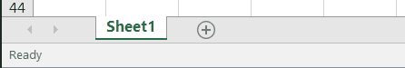

```

Call ProcessBarUpdater(i, 100, " Process Running: ")

Sub ProcessBarUpdater(intCurrent As Integer, intLast As Integer, strTopic As String)

    Dim intCurrentStatus As Integer
    Dim intNumberOfBars As Integer
    Dim intPercentDone As Integer

    '(Step 1) Display your Status Bar
    intNumberOfBars = 50
    'Application.StatusBar = "[" & Space(intNumberOfBars) & "]"

    '(Step 2) Periodically update your Status Bar
    intCurrentStatus = Int((intCurrent / intLast) * intNumberOfBars)
    intPercentDone = Round(intCurrentStatus / intNumberOfBars * 100, 0)
    Application.StatusBar = strTopic & " [" & String(intCurrentStatus, "|") & _
                            Space(intNumberOfBars - intCurrentStatus) & "]" & _
                            " " & intPercentDone & "% Complete"

    '(Step 3) Clear the Status Bar when you're done
    If intCurrent = intLast Then Application.StatusBar = ""

End Sub
```


进图条式样2及其代码如下图：

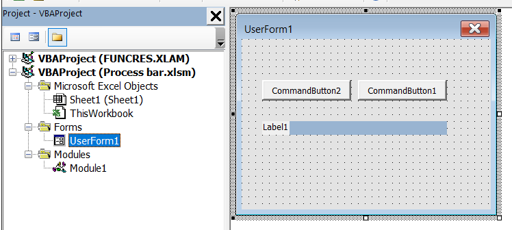

    
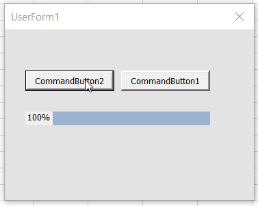


代码：

```
============== This code goes in Module1 ============
       
Sub ShowProgress()
    UserForm1.Show
End Sub

============== Module1 Code Block End =============

```


Create a Button on a Worksheet; map button to "ShowProgress" macro

Create a UserForm1 with 2 Command Buttons and 3 Labels so you get the following objects


| Element | Purpose | Properties to set |
|---------|---------|-------------------|
| `UserForm1` | canvas to hold other 5 elements | | 
| `CommandButton1` | Close UserForm1 | Caption: "Close" |
| `CommandButton2` | Run Progress Bar Code | Caption: "Run" |
| `Bar1` (label) | Progress bar graphic | BackColor: Blue |
| `BarBox` (label) | Empty box to frame Progress Bar | BackColor: White |
| `Counter` (label) | Display the integers used to drive the progress bar | |

Then add this code to UserForm1:

```
======== Attach the following code to UserForm1 =========

Option Explicit

' This is used to create a delay to prevent memory overflow
' remove after software testing is complete

Private Declare Sub Sleep Lib "kernel32" (ByVal dwMilliseconds As Long)

Private Sub UserForm_Initialize()
    Bar1.Tag = Bar1.Width  ' Memorize initial/maximum width
    Bar1.Width = 0
End Sub

Sub ProgressBarDemo()
    Dim intIndex As Integer
    Dim sngPercent As Single
    Dim intMax As Integer
    '==============================================
    '====== Bar Length Calculation Start ==========
    
    '-----------------------------------------------'
    ' This section is where you can use your own    '
    ' variables to increase bar length.             '
    ' Set intMax to your total number of passes     '
    ' to match bar length to code progress.         '
    ' This sample code automatically runs 1 to 100  '
    '-----------------------------------------------'
    intMax = 100
    For intIndex = 1 To intMax
        sngPercent = intIndex / intMax
        Bar1.Width = Int(Bar1.Tag * sngPercent)
        Counter.Caption = intIndex

    
    '======= Bar Length Calculation End ===========
    '==============================================


DoEvents
        '------------------------
        ' Your production code would go here and cycle
        ' back to pass through the bar length calculation
        ' increasing the bar length on each pass.
        '------------------------

'this is a delay to keep the loop from overrunning memory
'remove after testing is complete
        Sleep 10

    Next

End Sub

Private Sub CommandButton1_Click() 'CLOSE button
    Unload Me
End Sub

Private Sub CommandButton2_Click() 'RUN button    
    ProgressBarDemo
End Sub

================= UserForm1 Code Block End =====================
```


<a name="0x96"></a>
## 0x96 Excel VBA代码加密方案汇总（如何尽可能的保护VBA代码？）

> 该章节大部分内容学习摘自于：www.iaspnetcore.com


### 1.VBAProject工程设置密码

该功能是有微软官方提供，用于对VBA代码设置密码保护，设置方法参照：[2.3 设置VBA Macro Project 密码保护](#2.3)。

  
<br />

### 2.vbaProject.bin 破坏性锁定
使用UltraEdit软件打开vbaProject.bin文件，并使用Ctrl+F打开查找对话框，输入id=，定位到需要修改的位置。只要将id后大括号中的位元组随便修改一下即可。保存vbaProject.bin文件；

  
<br />

### 3.Unviewable + VBA

通过软件Unviewable + VBA加密的VBA效果最好。国内使用该软件加密的还不多，但国外很多使用该软件对其的VBA代码进行加密。

作者网址

http://www.spreadsheet1.com/unviewable-vba-project-app-for-excel.html

https://zhuanlan.zhihu.com/p/28203940

  
<br />

### 4.用VB6把VBA代码写成DLL

一般用VB6把VBA代码写成DLL不过麻烦，使用VB封装为dll进行调用的确可以。

    VBA code for Excel can only be written inside Excel using the VBA IDE. VBA projects are stored as part of the Excel file and cannot be loaded into Visual Studio.

具体实现源代码：

https://www.iaspnetcore.com/blog/blogpost/60a0d285b8d10f0221c4b424/encapsulate-vba-operations-into-dll-components-and-invoke-them-in-excel

  
<br />

### 5.通过VBE外接插件完成VBA代码的动态生成

通过外接插件完成VBA代码的动态生成，动态解密，实时运行，完毕删除这一系列保护代码的动作。

参见：http://club.excelhome.net/thread-1368804-1-1.html

  
<br />

### 6.VBA编辑器隐藏VBA代码

参见：https://github.com/outflanknl/EvilClippy

  
<br />

### 7.Use Excel Compiler, VBA Compiler 

Excel Compiler, VBA Compiler – software for Excel workbook copy protection

You can compile an Excel spreadsheet into an EXE application with securely protected formulas in binary format and protected VBA code.

参见：https://doneex.com/?option=com_content&task=section&id=10&Itemid=43&gclid=CKSepamRi6cCFQlPgwodbSTAeA

  
<br />

### 8.VBA Compiler for Excel

How the VBA Compiler works
The DoneEx VbaCompiler transforms source VBA code into C-code and, in the final stage, the C-language code is compiled into a native Windows DLL file.

It's easier and faster than converting your VBA code to C by hand. VBA Compiler website has a simple 10-step guide on how to compile VBA code into a Windows DLL file https://vbacompiler.com/how-to-compile/ and it doesn’t even require any knowledge of C or C++.

During compilation, the transformation of the source VBA code goes through several stages:

    Stage 1. VbaCompiler parses and analyses the source VBA code.
    Stage 2. The product generates object code based on results of stage 1.
    Stage 3. The product generates C-language code from the object code generated in 
    Stage 4. The VbaCompiler runs a C-compiler to compile the C-language code (which was generated in Stage 3) into a Windows DLL.
    Stage 5. The final stage of compilation – the VbaCompiler removes compiled VBA code from the file and generates connective VBA code where all compiled DLL functions are called instead of original VBA code.

参见：https://vbacompiler.com/

  
<br />

### 9.动态增加，删除，修改VBA代码

动态增加，删除，修改VBA代码是这种加密方式的核心价值。

VBA开发者可以提供给用户A数据，代码注册通过之后，动态生成B数据完成核心功能。或者根据程序流程，动态修改运行分支，这样使用者永远也不知道程序的真正运行流程，达到保密效果。

参见：http://club.excelhome.net/thread-1368804-1-1.html

  
<br />

### 总结

建核心代码库（函数名字典+密文代码+代码混淆）+ 动态解释 + 动态执行可以隐藏核心代码，处理好api和参数传递就可以了，不过没必要花那个功夫研究，VBA本身就是自用方便，能值得保密的商用程序有几个用vba写.

真正的加密只有源代码的加密，不是加个密码打不开就完了。
有的东西没法细说。大概说一下：

青铜：vba自带密码。   
黄金：借助网上的工具加密。其实还是设了密码，你能下到的工具，别人也能下到。不说了   
钻石：用源代码加密，动态调用。不限制你打开，但人眼不可识别，基本都是乱码，却不影响编译运行。   
王者：无招胜有招。无需任何加密，可以打得开，也都看的见源代码（非乱码），但是调用之错综复杂，语句之光怪陆离，除了本人基本没人能看得懂。   


  
<br />

<a name="docslist"></a>
## 0xFF VBA学习资源列表
- [MSDN 函数 (Visual Basic for Applications)](https://docs.microsoft.com/zh-cn/office/vba/language/reference/functions-visual-basic-for-applications)
- [Excel-vba coding规约/开发规范](CodingStandards.md)
- [Excel VBA 参考,官方文档,适用2013及以上](https://msdn.microsoft.com/zh-cn/library/ee861528.aspx)
- [Excel宏教程 (宏的介绍与基本使用)](http://blog.csdn.net/lyhdream/article/details/9060801)
- [Excel2010中的VBA入门,官方文档](https://docs.microsoft.com/zh-cn/previous-versions/office/ee814737(v=office.14))
- [Excel VBA的一些书籍资源,百度网盘](https://pan.baidu.com/s/17AcYDuHSLcuWZWwC9uWHNw)  （提取码: `mair`）
- [Excel 函数速查手册](https://support.office.com/zh-cn/article/Excel-%E5%87%BD%E6%95%B0%EF%BC%88%E6%8C%89%E7%B1%BB%E5%88%AB%E5%88%97%E5%87%BA%EF%BC%89-5f91f4e9-7b42-46d2-9bd1-63f26a86c0eb?ui=zh-CN&rs=zh-CN&ad=CN)
- [VBA的一些使用心得](http://www.cnblogs.com/techyc/p/3355054.html)
- [VBA函数参考](https://msdn.microsoft.com/zh-cn/library/office/jj692811.aspx)
- [VBA入门参考，英文](http://analystcave.com/vba-cheat-sheet/)


<a name="license"></a>
## 开源许可
本Repository除特殊注明外，均采用 Creative Commons [BY-NC-ND 4.0](LICENSE)（自由转载-保持署名-非商用-禁止演绎）协议发布。


## 鸣谢列表
### Code Contributors
|  | | |  | | | |
| :----: |:----: |:----: |:----: |:----: |:----: |:----: |
| [bluetata](https://github.com/bluetata) |[chromeheart](https://github.com/chromeheart) |[BobBJSun](https://github.com/BobBJSun) | [Martin Leduc](https://github.com/DecimalTurn) | | | |
