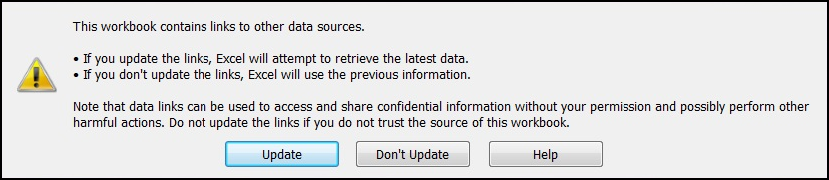
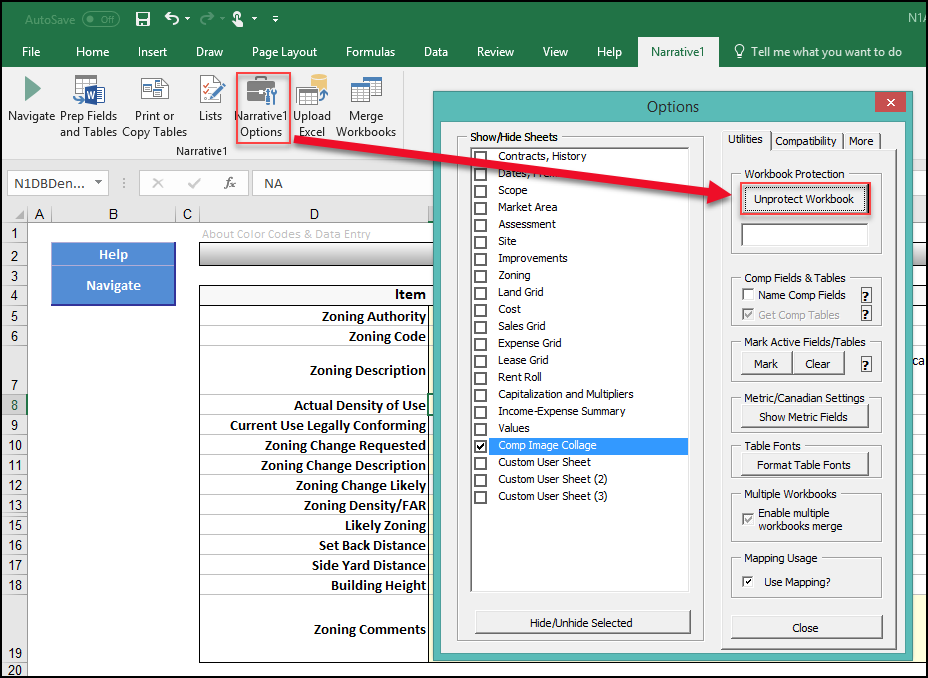
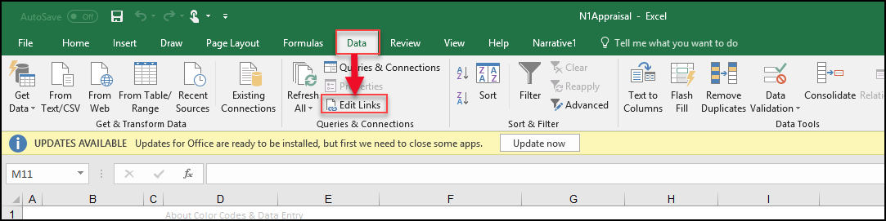
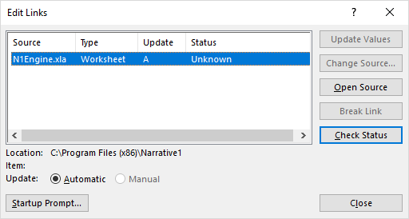
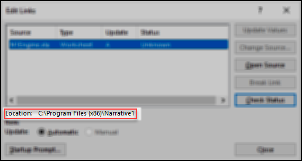
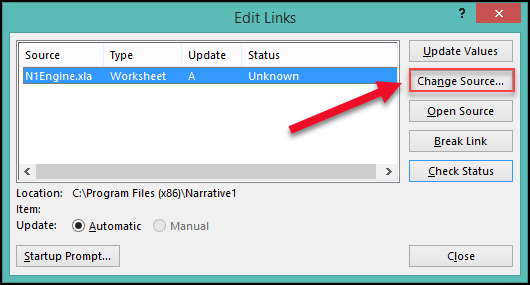
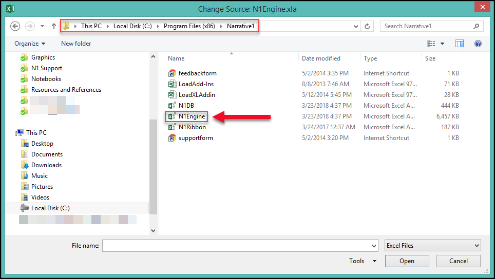
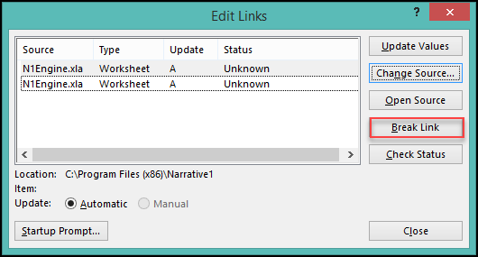
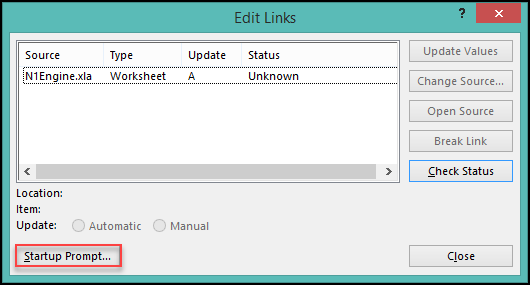
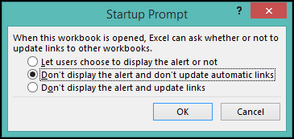

#### "This workbook contains links to other data sources" Error

**Symptom(s):** An error message states the following:

This workbook contains links to other data sources.

* If you update the links, Excel will attempt to retrieve the latest data.
* If you don't update the links, Excel will use the previous information.

Note that data links can be used to access and share confidential information without your permission and possibly perform other harmful actions. Do not update the links if you do not trust the source of this workbook.

   

**Typical Cause:** The N1Engine.xla add-in has an incorrect file path or other external links are present. Links to other external workbooks can also cause this error.

**Time required to fix:** ~5 minutes

**Solution:**

1. Unprotect your workbook by clicking on the Narrative1 Options button on the **Narrative1 ribbon**. Then click **Unprotect Workbook** if that button is visible.

   

2. Click on the **Data** ribbon in the top navigation bar, then click the **Edit Links** button.

  

You will probably see a single entry for *N1Engine.xla*.

Check the Location path for N1Engine.xla.

3. If the Location path for N1Engine.xla isn't in the Program Files folder of your main drive (typically C:\), click **Change Source**.

4. Navigate to C:\Program Files (x86)\Narrative1 (or C:\Program Files\Narrative1 on a 32-bit copy of Windows). Double click on the **N1Engine** file.

5. This might create a duplicate instead of changing the file path. If it does, click on the version with the incorrect file path and then click the **Break Link** button. If there are other external links listed that were not intentionally added, you can also click on them and **Break Link**.

6. Click the **Close** button in the bottom right-hand corner of the Edit Links window. If your workbook was previously protected, you may want to return to **Narrative1 Options** and re-protect it.

7. Close and then reopen the Excel spreadsheet; the pop-up message should no longer appear.

If the file path keeps re-setting to an incorrect one when you reopen the file (this can sometimes happen if it's stored on a cloud server like OneDrive), or if there are other external links shown that you can’t or don’t want to remove, you can safely just suppress the notice:

a. Reopen **Edit Links**.

b. Click the **Startup Prompt** button.

c. Select **Don't display the alert and don't update automatic links**, then click **OK**.

ref link: https://narrative1.zendesk.com/hc/en-us/articles/360002327233--This-workbook-contains-links-to-other-data-sources-Error
