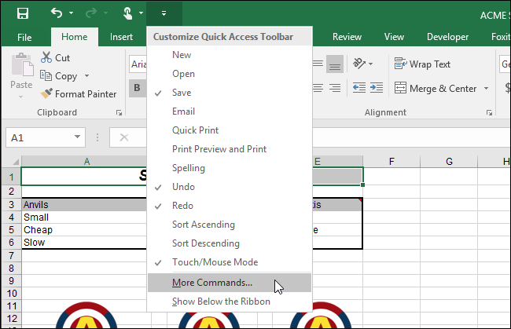
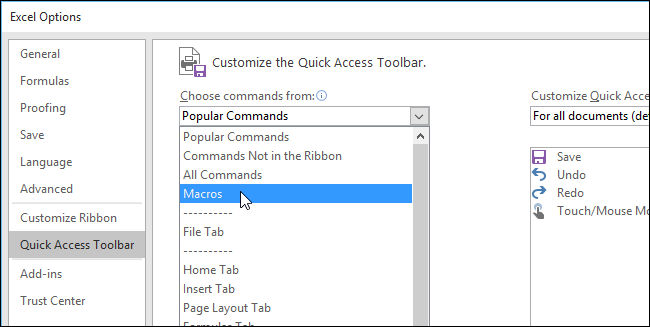
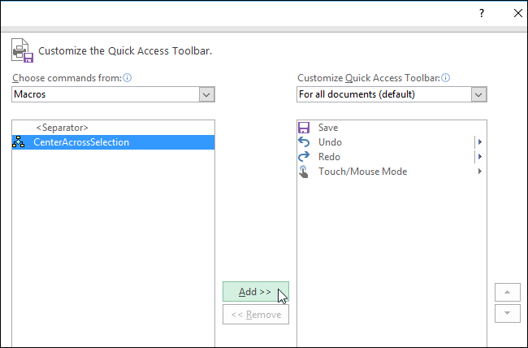
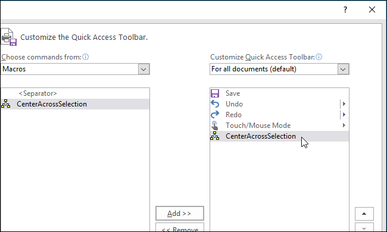
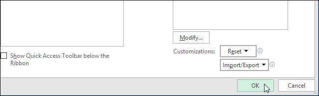
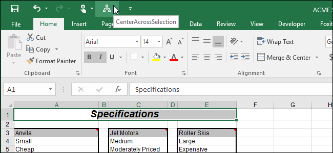

### 8.4 解决办法：添加一个宏文件到快速访问栏

(How to Add a Macro to the Quick Access Toolbar in Excel、Word)

有的时候我们把重复性的任务做成的Macro，添加到excel或者word中的快捷栏里，这样方便使用，或者将
Macro文件直接给其他同事，以便在他们的PC上直接使用，操作方法如下：

**方法如下：**   
 
Step1.  如下图所示，点击快速访问栏右侧下箭头按钮，选择 <b>*More Commands*</b>.

   

Step2.  在新弹出的对话框中 “Customize the Quick Access Toolbar” 画面选中 “Macros”。

  

Step3.  选中你所要添加的宏文件，点击<u>A</u>dd按钮,将宏文件添加到右侧。

  

添加到右侧效果如下图所示：

  

Step4.  点击OK按钮

  

最后效果如下：   

  
