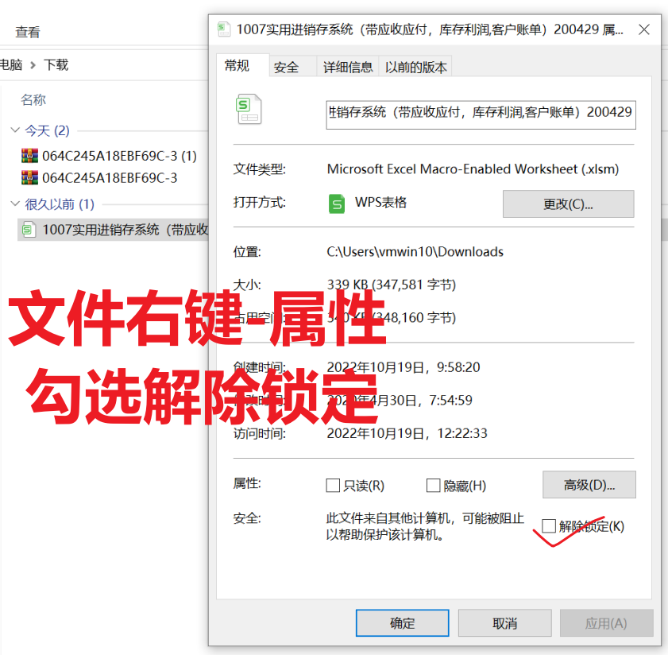
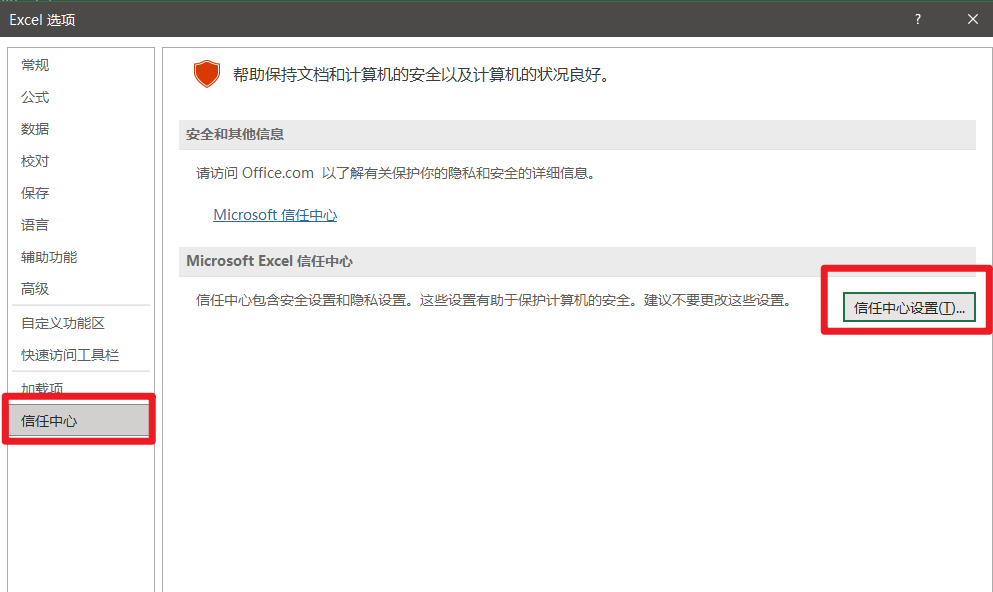
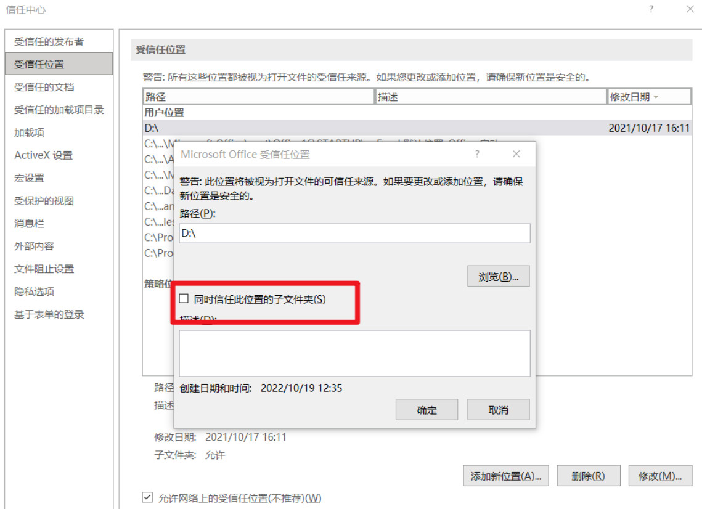

## 问题原因

> VBA 宏是恶意行为者获取访问权限以部署恶意软件和勒索软件的常用方法。 因此，为了帮助提高 Office 的安全性，我们正在更改 Office 应用程序的默认行为，以阻止来自 Internet 的文件中的宏。

可以参考微软原文：
https://learn.microsoft.com/zh-cn/deployoffice/security/internet-macros-blocked

## 解决办法：

### Step1：从文件中删除web标记 也就是右键属性 解除锁定

对于单个文件（例如从 Internet 位置下载的文件或用户已保存到其本地设备的电子邮件附件），取消阻止宏的最简单方法是删除 Web 标记。 若要删除，请右键单击该文件，选择 “属性”，然后在“常规”选项卡上选择 “解除锁定”复选框。

### Step2：添加受信任位置 对多个文件一起起作用

1. 选项里打开受信任位置面板

2. 添加受信任位置

这里可以选择添加一个自己的受信任位置 需要运行vba的都在这个目录下    
也可以简单粗暴的添加所有根目录 同时选择所有子目录 另外左下方允许网络位置    
也可以添加局域网共享位置 

完成所有设置后 重启excel再打开文件
如果还是出现安全阻止信息 请加我微信:`bluetata` 远程协助你